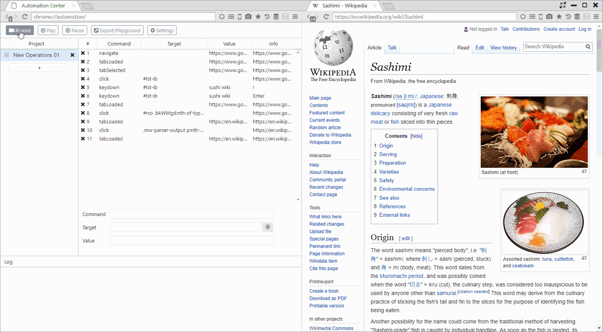
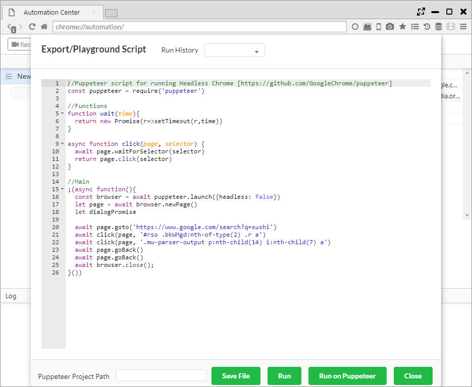

## Automation

With automatic operation assist functions such as iMacros and IDE,
we have implemented an API compatible with Puppeteer (automation in headless Chrome) API.

*********

### 1. Recording operation

Click the Record button at the top of the screen to start recording the operation.  
After completing the operation you want to record in one step, click the Record Stop button to end recording.

The first row of the project panel will become one save unit of the recording.   

The recorded operation will display the following items onscreen. 

- Command ・・・ Recorded comments (events) 
- Target ・・・ CSS selector of the process target 
- Value ・・・ Values used in the operation
- Info ・・・ Other information 

*********

### 2. Playing back recorded operation

Clicking the Play button plays the recorded operation.  

Clicking the pause button can temporarily stop the playback. 

*********

### 3. Export of recording, PlayGround

Clicking the Export/Playground button displays the automatic running script.   
This script became a script that could be run in Puppeteer.

From the lower part of pop-ups the following operation can be run. 

- Save File ・・・ Save the script as a JS file. 
- Run ・・・ Run script in Sushi Browser. 
- Run on Puppeteer ・・・ Run script in the project's Puppeteer designated by an "Puppeteer Project Path".  
- Close ・・・ Close the pop-up window. 

*********

### 4. Settings

- Playback Speed ・・・ Configure the script's playback speed. 
- Highlight Elements ・・・ Configure whether or not to highlight elements during script recording time. 
- Events Recorded ・・・ Choose events to record. 
- Hover Behavior ・・・ Set standby time as a mouse-over until it is recorded.

