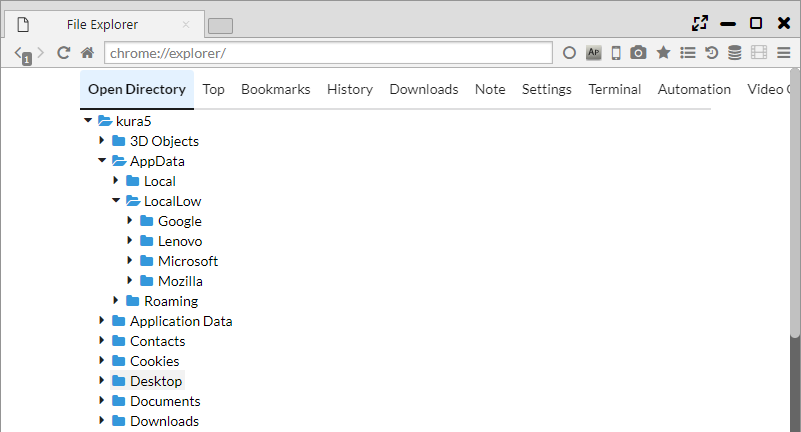

## Build-in Tool

Terminal, File Explorer, Video Player, Text editor are available.

*********

- Terminal: It can operate Bash for Linux/Mac and Power Shell for Windows. 
- File explorer: It can manage and browse files. 
- Video Player: It can be used for automatic playback of videos. 
- Text editor: It can edit text and source codes etc.

