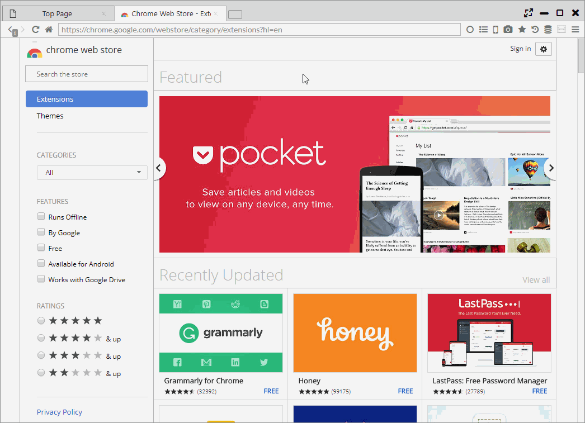

## Chrome Extension

This browser partially supports Chrome Extension. Also, some Firefox Addon (WebExtension) can be used.    

*********

### 1. Installation and Setting

You can install [Chrome Extension](https://chrome.google.com/webstore/category/extensions), [Firefox Addon](https://addons.mozilla.org/) from its official website.  

You can control and delete valid / invalid for the installed extension from "Settings > Extensions".  
Pressing the optional gear icon moves you to the settings page.

*********

### 2. Installation
In the installer version, Chrome Extension is installed in the following folder.  

- Windows: C:\Users[Name]\AppData\Roaming\sushiBrowser\resource\extension
- MacOS: /Users/[Name]/Library/Application Support/sushiBrowser/resource/extension
- Linux: ~/.config/sushiBrowser/resource/extension/

In the portable version, it is saved under "data/resource/extension" of the unzipped folder.

*********

### 3. Chrome Extension API
Some or all of the following APIs are supported.

- chrome.bookmarks
- chrome.browserAction
- chrome.browsingData
- chrome.commands
- chrome.contentSettings
- chrome.contextMenus
- chrome.cookies
- chrome.downloads
- chrome.extension
- chrome.history
- chrome.i18
- chrome.idle
- chrome.notifications
- chrome.pageAction
- chrome.proxy
- chrome.runtime
- chrome.sessions
- chrome.storage
- chrome.tabs
- chrome.topSites
- chrome.webNavigation
- chrome.webRequest
- chrome.windows

The unsupported API is as follows.

- chrome.accessibilityFeatures
- chrome.alarms
- chrome.certificateProvider
- chrome.debugger
- chrome.declarativeContent
- chrome.desktopCapture
- chrome.devtools
- chrome.documentScan
- chrome.enterprise
- chrome.events
- chrome.fileBrowserHandler
- chrome.fileSystemProvider
- chrome.fontSettings
- chrome.gcm
- chrome.identity
- chrome.instanceID
- chrome.management
- chrome.networking
- chrome.omnibox
- chrome.pageCapture
- chrome.permissions
- chrome.platformKeys
- chrome.power
- chrome.printerProvider
- chrome.privacy
- chrome.system
- chrome.tabCapture
- chrome.tts
- chrome.ttsEngine
- chrome.types
- chrome.vpnProvider
- chrome.wallpaper
- chrome.webstore
