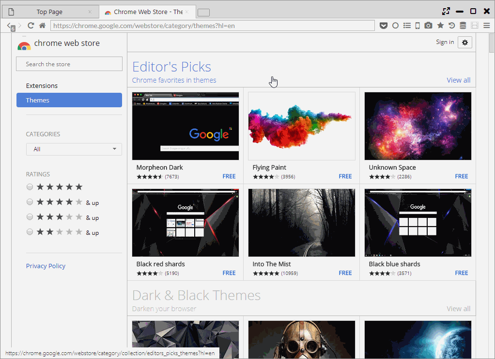

## Chrome Theme

You can apply chrome themes from the Chrome Web Store.

*********

### 1. Install

You can install themes from [Chrome Web Store](https://chrome.google.com/webstore/category/themes).

You can change and delete the theme from "Settings > Theme".  
You can also set whether to apply the theme style to each management page.

