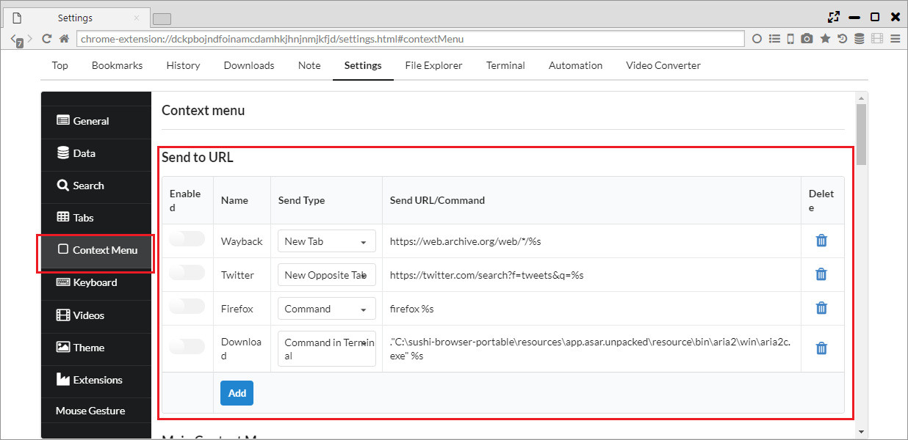

## Context Menu

In addition to the right click menu provided by the other browsers, this browser implements the original various menus.

*********

### 1. Send to UR

You can edit the URL of the link in "Settings > Context Menu > Send to URL" and send it or pass it to an external application.  

You can decide the destination from "Send Type".

- New Tab ・・・ Open the URL set in the new tab.
- New Opposite Tab ・・・ Open the URL set in the opposite panel.
- Command ・・・ Execute the set command
- Command in Terminal ・・・ Execute the set command in the terminal

You can set the URL or command to send from "Send URL / Command". The %s part will be replaced to the actual URL.

*********

### 2. Settings

You can set the display presence to right click menu from "Settings > Context Menu > Main Context Menu".

 - Back
 - Forward
 - Reload
  

 - Search for "" ・・・ Search the selected text or link text
 

 - Copy Links ・・・ Copy all selected links
 - Open Links in New Tabs ・・・ Open all the selected links in a new tab
 - Download Selection ・・・ Pass the selected link to the downloader
 - Save Page as…
 - Bookmark Page
 

 - Print…
 

 - Translate this page ・・・ 現Open the current page on opposite panel with Google Translate
 - Download All ・・・ Pass the link / media in the page to the downloader
  

 - Sync Scroll Left to Right
 - Sync Scroll Right to Left

 
 - View Page Source
 - Inspect Element
 

 - Open Link in New Tab
 - Open Link in Opposite Tab 
 - Open Link in New Private Tab
 - Open Links in New Tor Tabs
 - Open Link in New Session Tab
 - Open Link in New Window
 

 - Save
 - Save Link As…
 

 - Copy Link Address
 - Copy Link Text
 

 - Save and Play Video ・・・ Play the linked video on the default player at the same time with down load.
 - Send URL to Video Player ・・・ Sent a URL to the external player.

 - Cut
 - Copy
 - Paste
 

 - Open Image in New Tab
 - Save Image…
 - Copy Image
 - Copy Image Address
 

 - Loop ・・・ Loop the videos.
 - Muted ・・・ Mute the videos.
 - Show Controls
 - Play Video in Popup Window ・・・ Cut the video to the pop-up window.
 - Play Video in Floating Panel ・・・ Cut the video to the floating panel.
 

 - Open Video in New Tab
 - Save Video As...
 - Copy video address
 

 - Open Audio in New Tab
 - Save Audio As...
 - Copy Audio Address

 