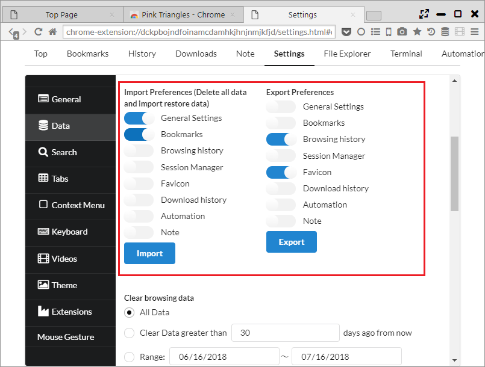
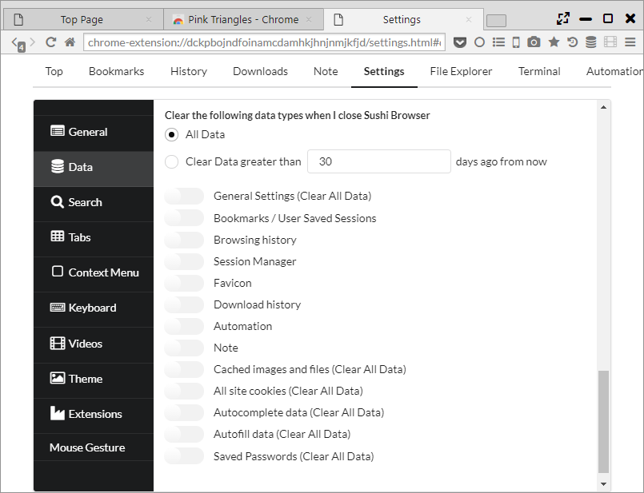

## Data import/export

From "Settings > Data" you can import data from other browser or various data export/import.

*********

### 1. Import browser data

When press import , "Import Browser Data" dialog will appear and you can import from Edge, IE, Chrome, Firefox data as follows:

- Browser History
- Bookmarks
- Cookies
- Passwords

*While browser from you are importing is starting up, there might be data which cannot be imported. Import should be done once starting up completed.  

Also, it can import bookmarks in HTML file format. 

*********

### 2. Export bookmarks 

Clicking the Export button exports bookmarks in HTML format. 

*********

### 3. Import/export settings 

it can import/export the following data in JSON format.   
When importing, please take note that all data will become converted. 

- General Settings
- Bookmarks
- Browsing history
- Session Manager
- Favicon
- Download history
- Automation
- Note

*********

### 4. Data deletion 

It's possible to delete data immediately or after closing the browser.   

The range of data to be deleted can be set with the following 3 patterns.  

- All Data ・・・ Delete all data.  
- Clear Data Greater than [N] days ago from now ・・・ Delete data from the present to N days ago. 
- Range ・・・ Delete data on a specified date. 

The following data will be deleted. Items stated with "Clear All Data" will all be deleted regardless of a specified range.

- General Settings (Clear All Data)
- Bookmarks / User Saved Sessions
- Browsing history
- Session Manager
- Favicon
- Download history
- Automation
- Note
- Cached images and files (Clear All Data)
- All site cookies (Clear All Data)
- Autocomplete data (Clear All Data)
- Autofill data (Clear All Data)
- Saved Passwords (Clear All Data)

