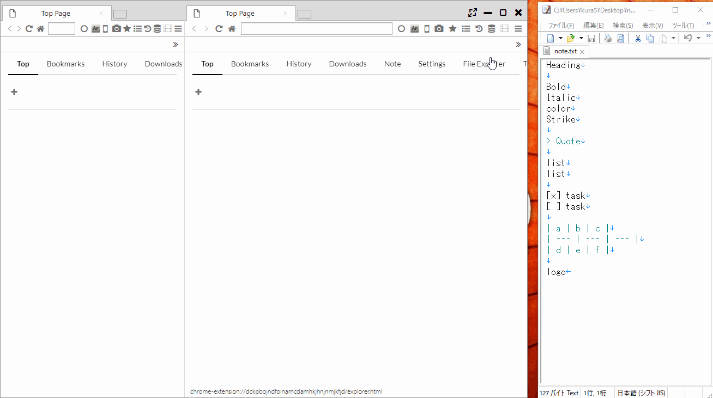
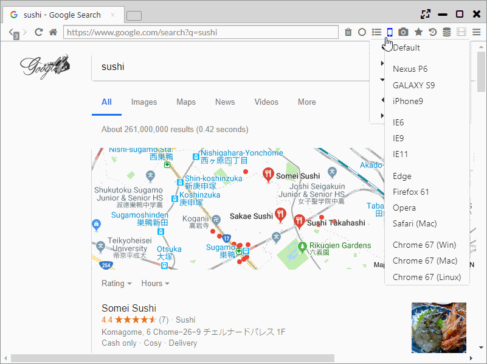

## Display Functions, Binding Window

It features various functions such as Fullscreen Mode and Always On Top, Fixing the Window to the Panel, Mobile Display (User Agent Change), AutoPagerize.

*********

### 1. Fullscreen Mode

By one of "click on the full screen button at the upper right of the screen", "press F11 key", "double click on the movie," you can enter Fullscreen Mode.

When you move the mouse cursor the menu gets displayed on the popup and it makes the full screen operation available.  

*********

### 2. Bind Selected Window (Windows and Linux only)

As an unique function on this browser, it becomes a function where it fixes and controls the windows of other apps against the tab on browser as if it’s an app inside one tab.   

It is supposed to be used to fix video players and text editors and perform the work in parallel.  

The binding will start by selecting "Main Menu > Bind Selected Window" and click an app you want to bind.  
The binding will be cancelled when you close the tab.

*********

### 3. Always on Top

Selecting "Main Menu> Always on Top" displays the target window as the topmost layer. 

*********

### 4. Mobile Mode

Clicking the celphone icon on the menu bar can change the page view to mobile view.  
Also, it's also possible to change the view to user agents other than mobile view. The following user agents can be used. 

- Nexus P6
- Galaxy S9
- iPhone
- IE6
- IE9
- IE11
- Edge
- Firefox 61
- Opera
- Safari (Mac)
- Chrome 67 (Win)
- Chrome 67 (Mac)
- Chrome 67 (Linux)

*********

### 5. AutoPagerize

This browser's default becomes ON by automatically reading the website's next page over multiple pages, and expanding the browser to carry out the extended view.   

It can be turned OFF from "Settings > Extensions" or the background of the menu bar.   
