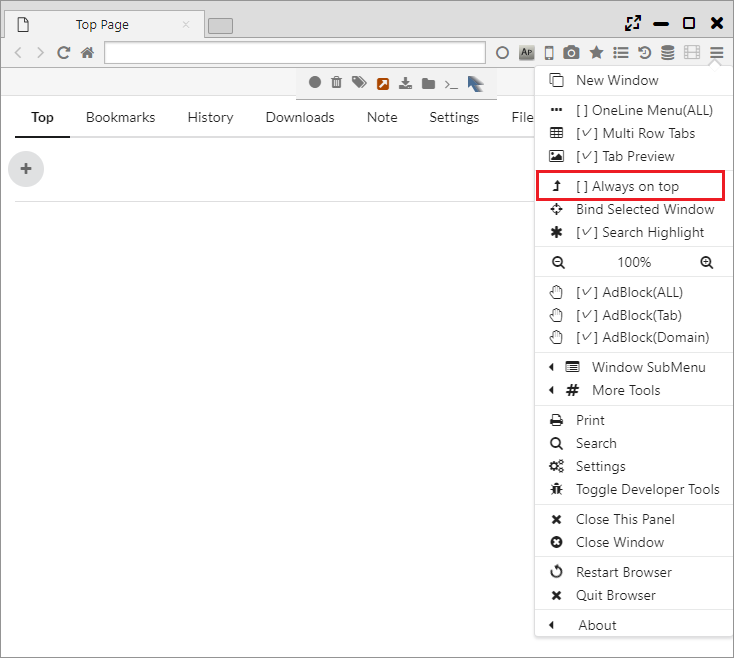

## Display Functions, Binding Window

It features various functions such as Always On Top and Fixing the Window to the Panel, Mobile Display (User Agent Change).

*********

### 1. Bind Selected Window (Windows and Linux only)

As an unique function on this browser, it becomes a function where it fixes and controls the windows of other apps against the tab on browser as if it’s an app inside one tab.   

It is supposed to be used to fix video players and text editors and perform the work in parallel.  

The binding will start by selecting "Main Menu > Bind Selected Window" and click an app you want to bind.  
The binding will be cancelled when you close the tab.

*********

### 2. Always on Top

Selecting "Main Menu> Always on Top" displays the target window as the topmost layer. 

*********

### 3. Mobile Mode

Clicking the celphone icon on the menu bar can change the page view to mobile view.  
Also, it's also possible to change the view to user agents other than mobile view. The following user agents can be used. 

- Nexus P6
- Galaxy S9
- iPhone
- IE6
- IE9
- IE11
- Edge
- Firefox 61
- Opera
- Safari (Mac)
- Chrome 67 (Win)
- Chrome 67 (Mac)
- Chrome 67 (Linux)

