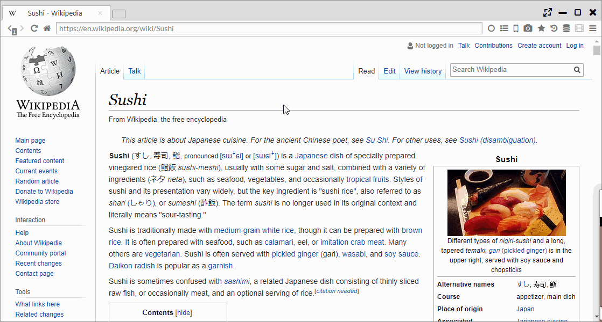

## Downloader

It features download function used express download library's Aria2c.  
It has systems of the maximum 16 parallel downloads and resume.  
In addition, like Firefox add-on DownThemAll!, by clicking the right, you can altogether download link, image and video.  
You can also bulk download by choosing multiple URLs from the Downloader page.  

*********

### 1. Parallel download	

You can set the number of parallel downloads by "Downloads per server" on Downloader page.

*********

### 2. Download on the page（Download All）	

By right-clicking on the page and select "Download All", you can do bulk download links and media files on the page.  

Also, by selecting text and then select "Download Selection", you can bulk download links within the selected range.

*********

### 3. Bulk Download	

At the dialog which starts after push the New DL button in the downloader page (chrome://download/),
it is possible to execute a sequential number download using a deployment of the wild card and to add the date information to a file name and so on.  
