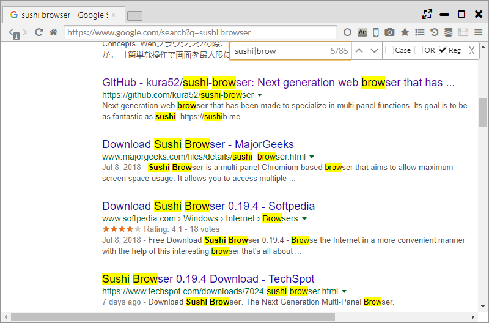

## Find in Page

In addition to the search function of Chrome, OR search and regular expression search can be performed. 
It is also equipped with "Search Highlight" function. 

*********

### 1. Search Options

Clicking Ctrl or Cmd+F or selecting Main Menu>Search can start a search within a page.    
The following options can be used in searches.  

- Case ・・・ Finding a search match by differentiating upper case and lower case characters
- OR ・・・ Carrying out OR searches using space division 
- Reg ・・・ Carrying out searches using regular expressions 

*********

### 2. Search Highlight

"Search Highlight" is a function that carries out searches within a page automatically of a search engine search word.  

When "ain Menu > Search Highlight" is turned ON,
the search word is highlighted on the search engine page and the next page.

When "Main Menu > More Tools > Search Highlight Recursive" is turned ON,
all pages after search will be subject to Search Highlight.
