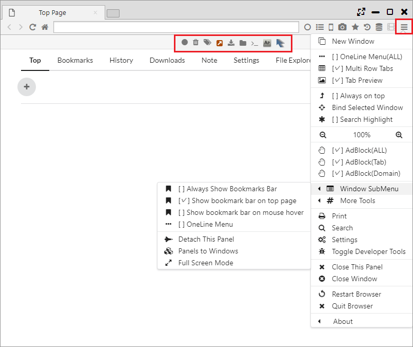
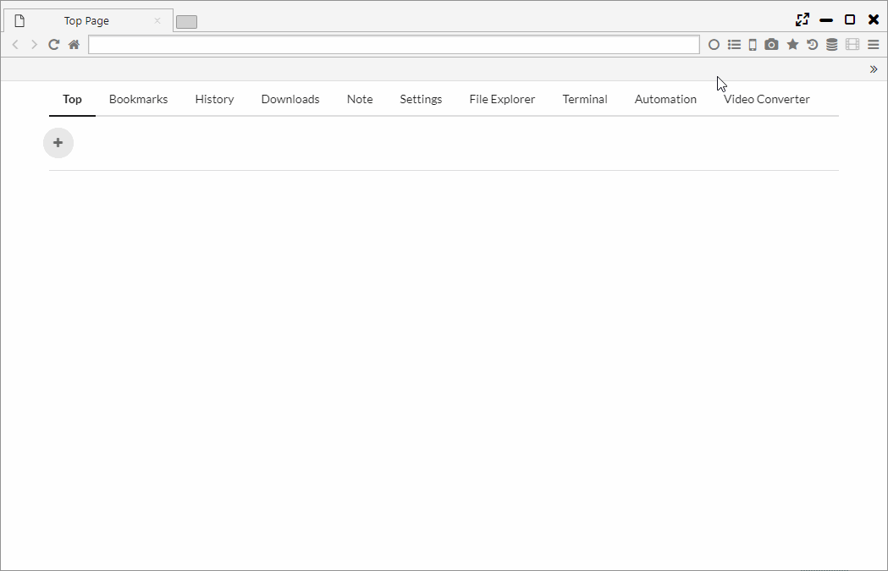

## Main Menu and Menubar

Explains the main menu and menu bar. 

*********

### 1. Main menu

- New Window
 

- OneLine Menu(ALL) ・・・ Switch to One Line mode 
- Multi Row Tabs ・・・ Switching of multi-row tabs.
- Tab Preview ・・・ Switching of Tab Preview
 

- Always on top
- Bind Selected Window ・・・Bind another window to the panel
- Search Highlight
 

- (-) 100% (+) ・・・ Change zoom ratio
 

- AdBlock(ALL) ・・・ Switching on AdBlock for all tabs 
- AdBlock(Tab) ・・・ Switching on AdBlock for each tab 
- AdBlock(Domain) ・・・ Switching on AdBlock for each domain 
 

- Window SubMenu
    - Always Show Bookmarks Bar
    - Show bookmark bar on top page
    - Show bookmark bar on mouse hover
    - OneLine Menu ・・・ Switch this panel to One Line mode
    - Detach This Panel
    - Panels to Windows ・・・ Separating the panel into windows 
    - Full Screen Mode
 

- More Tools
    - Open Opposite ・・・ Configure whether to open the opposite panel 
    - Search Highlight Recursive ・・・ Configure whether to repeat highlighted search 
    - Don't load tabs untill selected
    - Ask where to save each file before downloading
 

- Extract Audio from Video 
- Change Pdf View to Comic ・・・ Set pdf files to open in comic mode
- Sync Datas
 

- Print
- Search
- Settings
- Toggle Developer Tools
 

- Close This Panel
- Close Window
 

- Restart Browser
- Quit Browser

- About ・・・ Browser version information

*********

### 2. Menubar

Menu icon and Chrome Extension icon are displayed on Menubar.  
Also, if you display the Main menu, the background Menubar will be displayed.

Right-click on the icon on the menu bar and select "Sort Menu", you can sort icons on Menubar.
