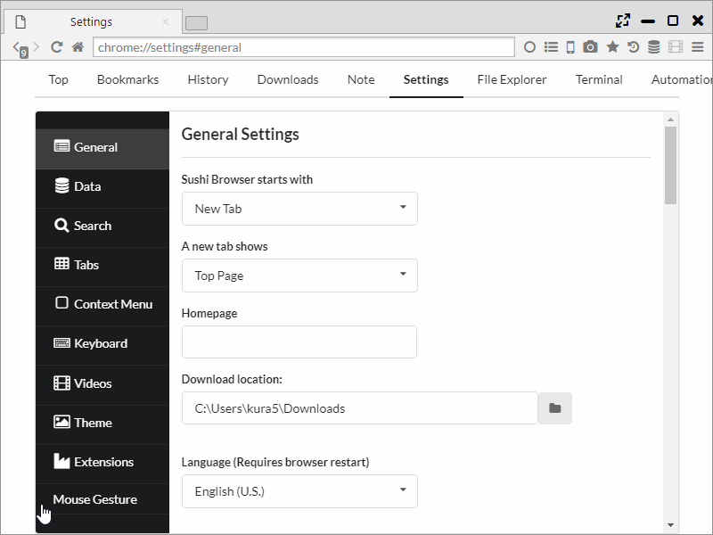

## Mouse Gesture

Assign gestures to various controls by using "Gestures for Google Chrome" from Chrome Extension.  
Unlike Chrome, you can use Mouse Gesture also on the administration page.   
Also, the context menu can be used on Mac/Linux version as usual.

*********

### 1. Settings
You can set Gesture from "Settings > Mouse Gesture".  

Basic settings and the setting whether to use Super Drag or not, can be set in the tab "Basics".  

In the tab "Actions" gestures can be assigned to controls.  
In "add new gesture" a new gesture can be added.

The configurable operations are as follows.

- None
    - no action
     

- Navigations
    - back
    - fastback
    - forward
    - go to ...
    - go to parent dir
     

- Tabs
    - open new tab
    - open new tab background
    - open blank tab
    - open blank tab background
    - open ... in new tab
    - open ... in new tab background
    - close this tab
    - close other tabs
    - close right tabs
    - close left tabs
    - pin this tab
    - unpin this tab
    - toggle pin tab
    - close left tab
    - close right tab
    - move tab left
    - move tab right
    - mute tab
    - freeze tab
    - protect tab
    - lock tab
    - bookmark page
    - view page source
    - load url from clipboard
    - paste and open
     

- Links
    - open link in new tab
    - open link in new tab background
     

- Windows
    - open new window
    - close this window
     

- TabNavigations
    - select right tab
    - select left tab
    - select last tab
    - select first tab
    - re-open closed tab
    - clone tab
     

- Scroll
    - scroll up
    - scroll down
    - scroll right
    - scroll left
    - scroll down half page
    - scroll up half page
    - scroll down full page
    - scroll up full page
    - scroll to top
    - scroll to bottom
     

- Load
    - reload
    - cacheless reload
    - reload all tabs
    - stop
     

- Clipboard
    - copy url
    - copy url and title
    - copy url and title as html
    - copy url and title by custom tag ...
     

- ScreenShot
    - full page capture to clipboard
    - full page capture as JPEG
    - full page capture as PNG
    - selection capture to clipboard
    - selection capture as JPEG
    - selection capture as PNG
     

- Others
    - config
    - run script ...
    - find in page
    - quit browser
    - restart browser
    - split left
    - split right
    - split top
    - split bottom
    - swap position
    - switch direction
    - align horizontal
    - align vertical
    - switch sync scroll
    - open sidebar
    - enable search highlight
    - change to mobile agent
  