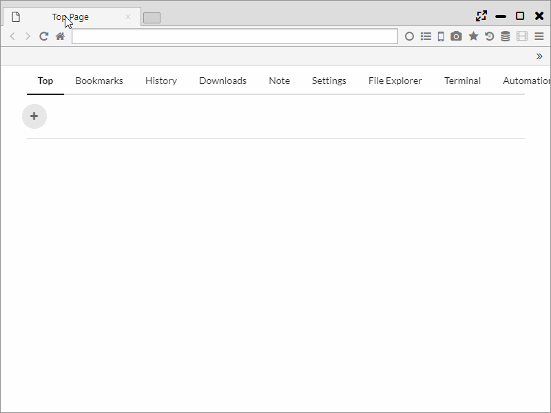
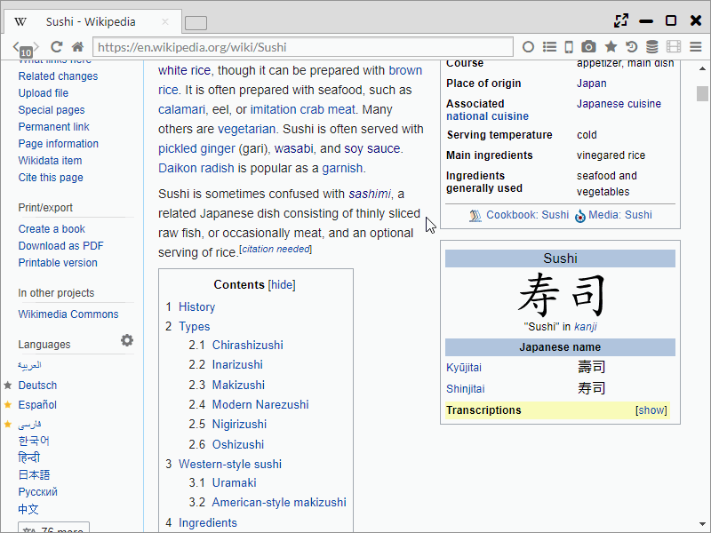
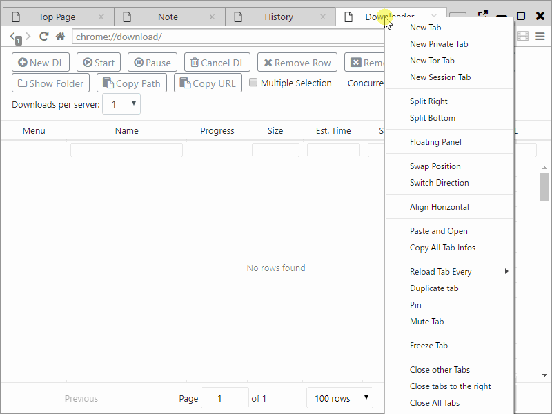

##Multi Panel

The biggest feature of Sushi Browser is that it specializes in display and operation with Multi panel.  
In addition to displaying multiple web pages side by side, there are various functions that you can do only on this browser.

*********

### 1. Split Panel
The panel can be divided by dragging the tab towards the corner of the panel.  
It can also be divided from the right click menu on the tab as well.

The divided panel is available for the size change as well.

*********

### 2. Display to the opposite panel  
By **middle clicking (pressing the mouse wheel)** the link you can open the page in the link to the opposite panel.   
**Middle clicking** with 1 panel automatically splits the display into 2 panels.   

Of course, just like ordinary browsers, it can be configured to open a new browser.  
(You can switch it with "Main Menu > More Tools > Open Opposite" .)　

Also, it changes to the motion where it opens background tab by holding down the centre click.

*********

### 3. Sync scrolling
By pressing the Sync scroll button, 1 page can be lined up like the pages of a book.  
Moreover, for a group of panels at this state, you can do actions such as scroll, page transition or close at the same time. 　
 
Also, right clicking the we page, you can choose from a menu for a 2-page spread that reads left to right or from right to left. (Commonly it's left to right) 

 - Sync Scroll Left to Right
 - Sync Scroll Right to Left
 

*********

### 4. Side (bottom) bar
You can open favorite pages or pages from your history using the side bar.  
The side bar can display web pages same as common panels. 　　  
The difference to common panels is even if you change the window size, the width remains fixed, and only this cannot be used with sync scrolling. 

By pressing "<< " button on the Sidebar, you can set it to the hide mode.

*********

### 5. Panel movement
For general browser, by dragging and dropping the tab, you can move the tab.  
In addition to moving the tab, this browser can be moved all the tabs of one panel to other panel or window by dragging or dropping the tab addition button.

*********

### 6. Floating panel mode
By selecting Floating Panel from the menu that is displayed by right clicking a tab,you can detach the panel that can be moved within the window.   
It is a function that can be used for playing videos etc. while web browsing. 

*********

### 7. Slim menu
In order to make the best use of the screen space, you can switch to one line menu.    
Using a display method that integrates the menu bar and tab bar, it achieves a menu with a mere 30px.   

*********

### 8. Swapping and Aligning panels, Switch direction
 - You can switch the position of 2 panels.  
 - Panels can be lined up with fixed widths horizontally or vertically. 
 - You can realign vertically-lined panels horizontally or horizontally-lined panels vertically. 
 

*********

### 9. Sync Scrolling, Link Dragging
 - By moving the mouse wheel, you can scroll 2 panels at the same time.
 - By dragging and dropping, You can open the link text to another panel.
 

*********

### 10. Simultaneous page transition 
By using a regular expression, the page URL can be permutated and opened in a different page.  
It can also open a normal page at the left and Google Translate at the right.   

The method of entering data is entering the regular expression for the URL at the left, and entering the text after permutation at the right.   
By using () at the left makes it CAPTCHA, and can be used for the content after permutation using numerals.   
(It can be used as text which was encoded with $$ numbers.)   

For example, by making the left side `(.+)` and the right side `https://www.google.com/search?q=$$1`, the target URL can be Google-searched. 

