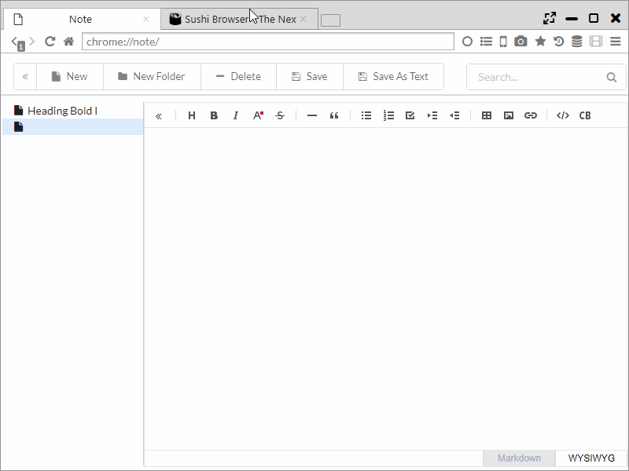

## Note

It features a note (memo) function that can be used from Top Page or Sidebar.  
Using [TOAST UI Editor](http://ui.toast.com/tui-editor/), it can be edited in WYSIWYG format (edit as seen) and Markdown format.

*********

### 1. Editing in WYSIWYG format

WYSIWYG mode is an input form close to Office's Word.  
When copying and pasting a web page or an image, the format is retained as it’s entered.  
Input results are saved each time.  

The tool button at the top of the editor has the following functions. 

- Hide Sidebar

- Headings・・・ Change the font size for heading
- Bold
- Italic
- Text color
- Strike ・・・ Add strike through to character

- Line ・・・ Insert divider line
- Blockquote ・・・ Changed to quotation typeface

- Unordered list
- Ordered list
- Task ・・・ Add checkbox
- Outdent
- Indent

- Insert table
- Insert image
- Insert link

- Code
- Insert CodeBlock

*********

### 2. Edit in Markdown format

Markdown mode has input function and preview display function in markdown.  
The following 2 buttons are added to the toolbar on the editor.
- Change Markdown Preview Style ・・・ Switch Tab and Vertical preview modes
- Switch Line Wrapping ・・・ Toggle setting of whether to collapse rows at the end of the window

Switching to preview mode via the tab enable you to create simple text like that in a notepad.   

In markdown mode, the following keyboard shortcut can be available.  

- Ctrl-F / Cmd-F ・・・ Start searching
- Ctrl-G / Cmd-G ・・・ Find next
- Shift-Ctrl-G / Shift-Cmd-G ・・・ Find previous
- Shift-Ctrl-F / Cmd-Option-F ・・・ Replace
- Shift-Ctrl-R / Shift-Cmd-Option-F ・・・ Replace all
- Alt-G ・・・ Jump to line

In addition, switching to markdown mode allows you to edit the document after converting html and after pasting in WIYSIWYG mode.  

*********

### 3. Make a note of the selected range

If you select text on the webpage and select "Add to Note" from the right-click menu,
then the selected content is transferred to the notepad and the tab is opened.

*********

### 4. Output function to text format

By pressing the "Save" button or "Save As Text" button, you can save the note you created as a text file.  

- With the "Save" button, the file is output in Markdown format.  
- With the "Save As Text" button, file is output in Plain Text format.

