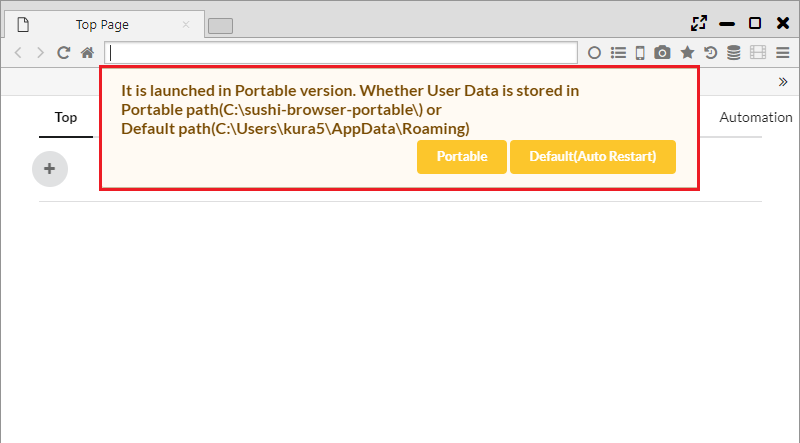
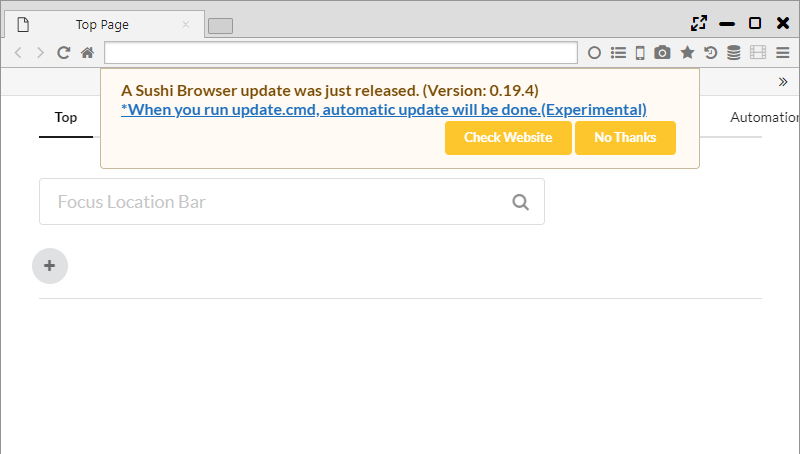

## Portable Edition

With Sushi Browser, you can choose between installation version and portable version.  
In the portable version, user data can be saved in the same folder as the executable file.
Therefore you can easily carry the data to other PCs, or launch multiple portable version browsers in the same PC.  

*********

### 1. Destination to save the setting file
When starting the portable version, the following message will be displayed.   
Below is the message when unpacking to "C:\Users\\[User Name]\Downloads" on Windows.　

>It is launched in Portable version. Whether User Data is stored in
>Portable path(C:\Users\\[User Name]\Downloads\sushi-browser-portable) or
>Default path(C:\Users\\[User Name]\AppData\Roaming)

By pressing the Portable button, the user data is saved in the same folder as the executable file.  
By pressing the Default button, the user data is saved in the same folder as the installation version.

Also, with the Portable version, each data can be kept in the following holders.  

- data/resource/extension ・・・ The Chrome Extension / Theme are saved.
- db/resource ・・・ The user data is saved
    - automation.db - Data for automation
    - automationOrder.db - Data for automation
    - download.db - Data for download
    - downloader.db - Data for download
    - favicon.db - Favicon data
    - favorite.db - Bookmark data
    - history2.db - History data
    - image.db - Image data for speed dial
    - note.db - Note data
    - savedState.db - Session data
    - searchEngine.db - Search engine settings
    - state.db - General settings
    - syncReplace.db - Synchronous page transition data
    - tabState.db - Tab history data
    - token.db - Sync data
    - visit.db - History data
    - windowState.db - Session data
    

*********

### 2. Update (Windows only)

When the next version of browser is found, the version-up dialog can be shown.  
Click "When you run update.cmd, automatic update will be done.(Experimental)" of the dialog message, and carry out the update.cmd, the automatic update will be done.

