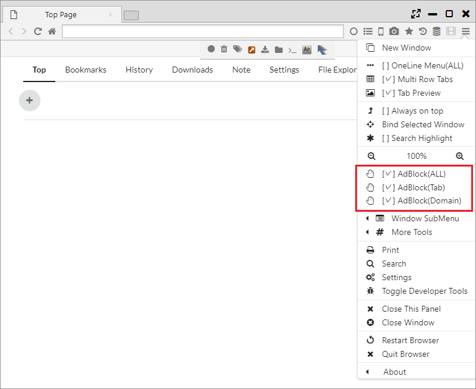
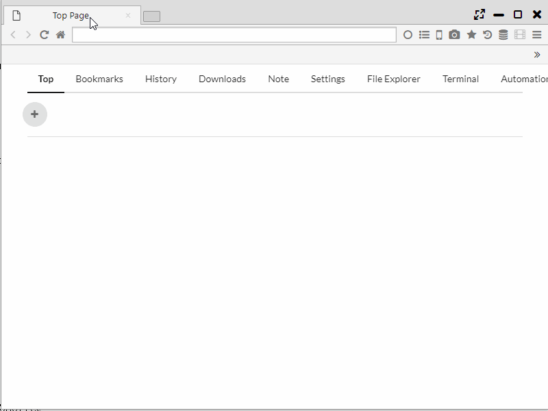
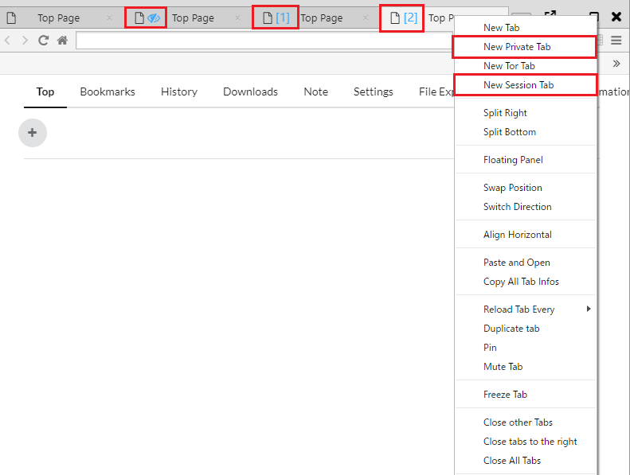
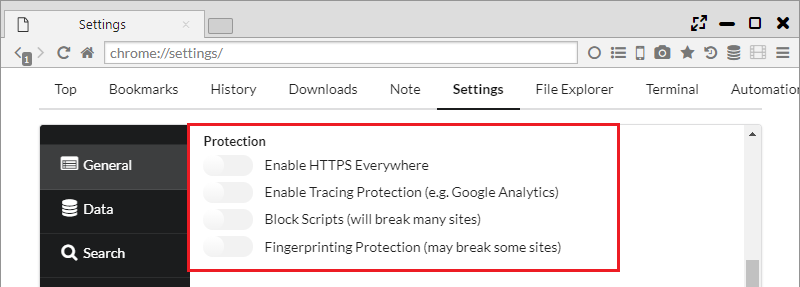

## Privacy and Security

Sushi Browser carries functions regarding the privacy and security refering to the fonction of Brave Browser.  
Adblock, Tor · Private · Session tab, VPN, HTTPS Everywhere, Tracking Protection, Fingerprinting Protection are carried.  

*********

### 1. Adblock	
Equipped with a native-implemented high speed advertisement block.
It is possible to set up the validity or invalidity in all page, each tab and each domain from Main menu.  

*********

### 2. Tor Tab	
This will be a tab where it uses anonymous networking system “Tor”. It makes network with high anonymity possible.  

*********

### 3. Private, Sesison tabs
These have a Private tab that strengthens its privacy and a session tab function where it makes the operation in separate sessions possible as other browsers.  
In Session tabs, a tab gets a series number on the tab in each session.

*********

### 4. VPN (Windows only)
It does VPN search with MS-SSTP VPN by using VPN Gate service.  
* Since it creates and connects an actual VPN network connection on Windows, not a pseudo VPN, and network profiling is created.    

When the "VPN server" is selected in "Main Menu > More Tools > Change VPN Mode", VPN communication is generated.  

*********

###5. Other Privacy Protection Functions
- HTTPS Everywhere ・・・ Function to replace http communication with https communication as much as possible
- Tracking Protection ・・・ Protection function from tracking services such as Google Analytics
- Block Scripts ・・・ Function to disable Javascript (will break many sites)
- Fingerprinting Protection  ・・・ Function to protect information reading by fingerprinting

