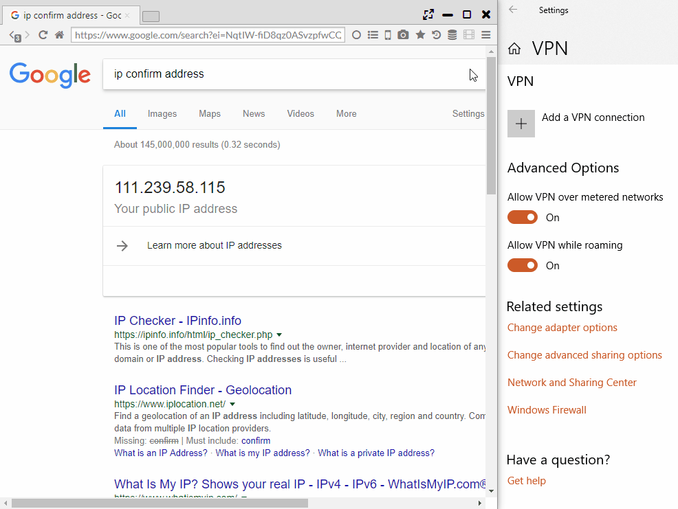

## Privacy and Security

### . VPN (Windows only)
It does VPN search with MS-SSTP VPN by using VPN Gate service.  
* Since it creates and connects an actual VPN network connection on Windows, not a pseudo VPN, and network profiling is created.    

When the "VPN server" is selected in "Main Menu > More Tools > Change VPN Mode", VPN communication is generated.  

