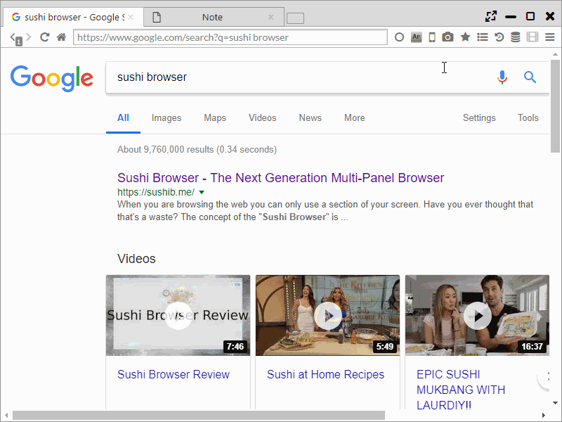

## Screenshot

Screenshots of the whole page or of a selected area can be made.  

Mousing over the camera icon of the main menu displays the below menu and screenshots can be obtained.  
 - Full Page | Clipboard ・・・ Save whole page screenshots to clipboard 
 - Full Page | Jpeg ・・・ Save whole page screenshots in JPEG 
 - Full Page | PNG ・・・ Save whole page screenshots in PNG 
 - Selection | Clipboard ・・・ Save selected area screenshots to clipboard
 - Selection | Jpeg ・・・ Save selected area screenshots in JPEG 
 - Selection | PNG ・・・ Save selected area screenshots in PNG 
 
If selected area screenshots is selected, the background turns grey.  
Afterwards, holding the left click, moving the mouse then releasing determines the selected area to be screenshot. 

