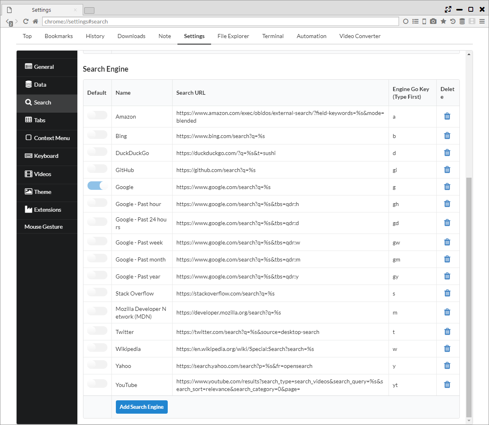
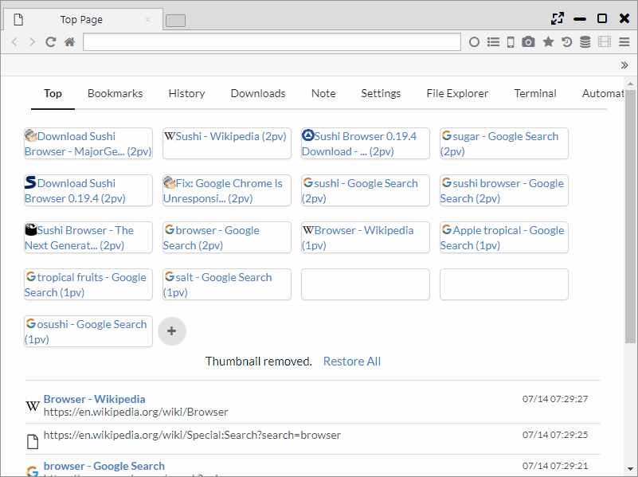

## Search Engines

It features a powerful search function such as searching a selection range and simultaneous search with multiple search engines.  

*********

### 1. Search Engine Setting (Shortcut Search)	

You can add, delete search engines from "Settings > Search > Search Engine", and change the default search engine.  
In addition, you can set shortcut keys that can be used for searching.  

*********

### 2. Search selected range, link text	

By right-clicking the selected text or link text, you can search for the target text.  
You can also select whether to open in the current panel (c) or open in the opposite panel (o), and you can also set whether to display from the setting page.  

*********

### 3. Simultaneous multiple searches	

This browser has a **"multiple simultaneous search function"**, not found in other browsers.

You can select a combination of search engines and display methods via "Settings > Search > Multi Search".  
The display method has the following patterns.

- open a panel ・・・ Open all tabs in one panel.
- open 2 panels ・・・ Open the tabs alternately for the two panels.
- open to new window ・・・ Open all tabs in one panel of the new window.
- a row in new window ・・・ For a new window, split the panel vertically for each tab and display it on the one rows panel.
- 2 rows in new window
- 3 rows in new window

*********

### 4. Search address bar	

Suggestions by search engines and suggestions by history are available in the address bar. In addition to the title and the URL, the suggestion shows the number of PVs and the past stay time.  
Also, you can change the search engine to be used from the default by entering the shortcut key.

From the "Settings > General > Autocomplete data", you can change the order of the suggestion, the number of cases by the following.  

- Order of AutoComplete ・・・ "Suggestion by search engine → History" or "history → suggestion by search engine"
- Number of Suggestions ・・・ Set the number of "Suggest by search engine" display
- Number of Histories ・・・ Set the number of suggestion by "history" to be displayed
- Sort history in descending order of PV ・・・ Arrange the order of sorting by "history" in ascending order of page views (usually in the order of newest date)

