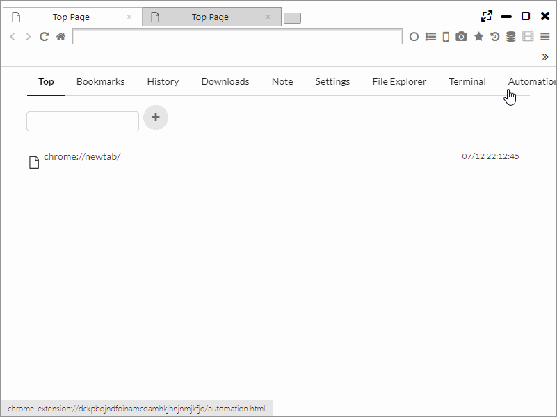
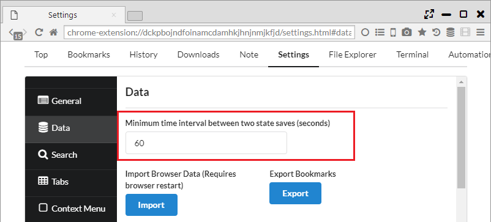
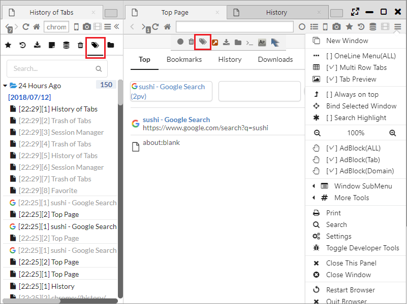

## Session Manager

This browser has a session control system that preserves the condition of the window of browser and tab at regular interval and plays.  
There is also a function for the recover of tab like a tab trush and a tab record.  

*********

### 1. Restoration of windows and tab states by Session Manager

It is possible to open Session Manager from the icon :fa-database: of Menubar or Sidebar.  
The session is composed by Window group and by tab group which is in the window. If there are over two windows, the tabs corresponding to each window will be preserved.  
If you practice a right click at the preserved session, the following menu will be displayed and you can restore and operate the session.  

- Open Link in New Window ・・・ Restore the session
- Edit ・・・ Rename the session
- Delete ・・・ Delete the session

*********

### 2. User saved session

If you click the "Save Current Session" at the Session Manager of Menubar, it is possible to preserve and restore the current session at the "User Saved Sessions".

*********

### 3. Setting of saving interval

From "Settings > Data > Minimum time interval between two state saves (seconds)" you can set the session retention period.  
Once the retention period passed and the session remains unchanged, saving processing wil be skipped.  

********
	
### 4. Tab Trash	
It is possible to open the tab trash from the icon :fa-trash: of Menubar or Sidebar.   
The tabs at the time of the closing in the past are stored in the tab trash, and it is possible to restore the selected tab.  

********

### 5. Tab History

It is possible to open the tab history from the icon :fa-tags: of Menubar or Sidebar.  
The tab history hold all past tab transition history. Except the page active at the end, they are all in grey color.  

