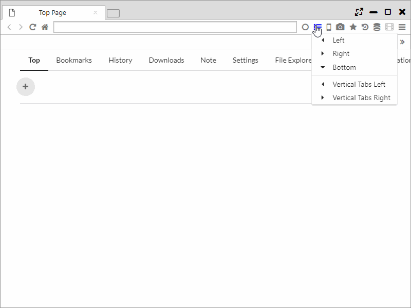
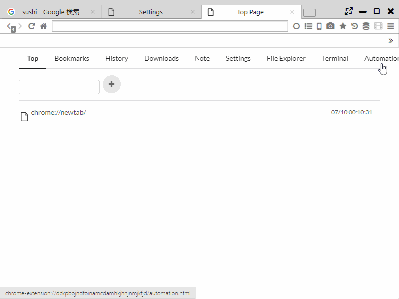
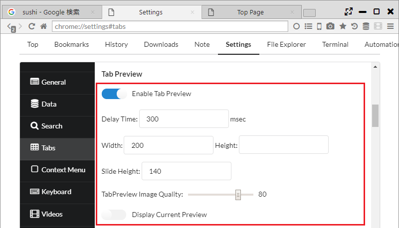

##Tab

With regard to the tab function too, Sushi Browser actively incorporates effective use and convenient functions for the screen.   
For example, it incorporates a number of functions equivalent to the Firefox add-on Tab Mix Plus.  

*********

### 1. Multi-row tab
Multistep tabs can be used in the Sushi Browser. and ordinary tabs can be switched to Multi-row tabs from the main menu.  
Also, the number of steps of the multistep tabs and the maximum and minimum tab width can be configured from "Settings > Tabs".  

*********

### 2. Vertical Tab, Tree Tab
Horizontal tabs can be used in Sushi Browser. Vertical tabs can be displayed from the sidebar icon of the menu bar.   
It's also possible to hide ordinary tabs when displaying vertical tabs.  

Also, tree tabs can also be used (layers in the order of which the tabs were opened). The relationship between panels are displayed by numbers.  

*********

### 3. Tab selection using the mousewheel
By moving the mousewheel over the tab bar, tabs can be selected by scrolling.   
Also, it is possible to set circulation type selection(when it is to the end, it moves to the first tab next)

*********

### 4. Tab Preview
You can use Tap Preview of Pop-up method and sliding method.(Same as Edge or Vivaldi)  
You can switch ON/OFF from Main menu.  
Also, you can set the size or the image quality of Tab Preview, display timing.  

For the Tab Preview of Pop-up method, you can also set below.  

 ・ When you make Width or Height empty, it set the size automatically from the aspect ratio. When you make both Width and Height empty, it is displayed in the actual size.    
 
 ・ When you set the "Display Current Preview" ON, the latest preview is always displayed. (it is displayed the preview of when completed the loading by default.)

******

### 5. Tab setting

#### General Settings

- Open links that open in a new window in (select one): 
    - New window - opens a new browser window
    - New tab - creates a new tab in the current browser window

- When closing the current tab, focus (select one):
    - Almost the same as chrome
    - Left tab
    - Right tab
    - Last selected tab
    - Opener/Right tab (the tab containing the link that opened this tab or the tab to the right)
    - Opener/Left tab
    - Last opened tab
    - First tab
    - Last tab
  

- Do not close window when closing the last tab (closing the last tab will also close the browser window)

- Reload Tab Every (seconds) ・・・ You can set the interval of auto reload function.

- TabBar Top Margin ・・・ You can set the margin size on the top of the tab bar.

- Remove Top Margin When Maximizing ・・・ You can set whether to erase the margin on the top of the tab bar when it is maximized.

***

#### New Tab

- Open New Tab next to current one

- Open New Tabs At
    - Default Position
    - Left End
    - Right End

- Force to open in new 
    - Nothing
    - Links to other sites
    - All links

- Open New Tab in Background

- Opposite Mode ・・・ if you open the background tab, it will be opened as tab of facing panel.

***

#### Tab Preview

- Enable Tab Preview

- Delay Time ・・・ Delay time until the Tab Preview indication

- Width, Height ・・・ Size of Tab Preview
 
- Slide Height ・・・ Tab Preview high of the slide method

- TabPreview Image Quality

- Display Current Preview ・・・ Always displaying the latest preview

***

#### Show on Tab

- Multi-row

- Max number of rows to display ・・・ Setting of the maximum step number of the multi-row tab.
- Tab Width

***

#### When scrolling over the tab-bar

- Change selected tab

- Inverse scroll direction

- Circulate Tab Selection

***

#### Tab Focus

- Select tab pointed for

- Switch to last selected tab when clicking current one

***

#### Mouse Clicking

- Double-click

- Middle-click

- Alt-Click

***
#### New tab button

- Right Click

- Middle-click

- Alt-Click

*******

### 6. Tab operation (tab context menu)

- New Tab
- New Private Tab
- New Tor Tab
- New Session Tab

- Split Left
- Split Right
- Split Top
- Split Bottom
- Split left tabs to left ・・・ Spliting a tab left than a current tab into the left panel.
- Split right tabs to right ・・・ Spliting a tab right than a current tab into the right panel.

- Floating Panel ・・・ Detaching a tab from a floating panel.
- Swap Position ・・・ Exchange the position of the panel.
- Switch Direction ・・・ Exchange the direction of the panel.
- Align Horizontal
- Align Vertical

- Copies the tab's URL to the clipboard
- Load URL from clipboard
- Paste and Open ・・・ Open an URL of the clipboard on a new tab. (It is possible to open multiple URL with a break of a new line.)
- Copy Tab Info ・・・ Copying a tab information(number, URL, title)
- Copy All Tab Titles ・・・ Copying all tab titles
- Copy All Tab URLs ・・・ Copying all tab URLs
- Copy All Tab Infos  ・・・ Copying all tab information(number, URL, title)

- Reload
- Clean Reload
- Reloads all tabs
- Reloads other tabs
- Reloads left tabs
- Reloads right tabs
- Reload Tab Every

- Duplicate tab
- Pin ・・・ Putting a tab to the left edge and displaying only favicon.
- Mute Tab
- Freeze Tab ・・・ Protecting and Locking a tab.
- Protect Tab ・・・ Disallow the close of tab
- Lock Tab ・・・ All the links on the tab become open in new tab

- Close
- Close other Tabs
- Close tabs to the left
- Close tabs to the right
- Close All Tabs
- Reopen Last Closed Tab
- Reopens all closed tabs

- Bookmark Page
- Bookmark all tabs

- Reload
- Clean Reload

- Close tabs
- Close This Tree ・・・ Closing a tab every hierarch of the tree tab.

