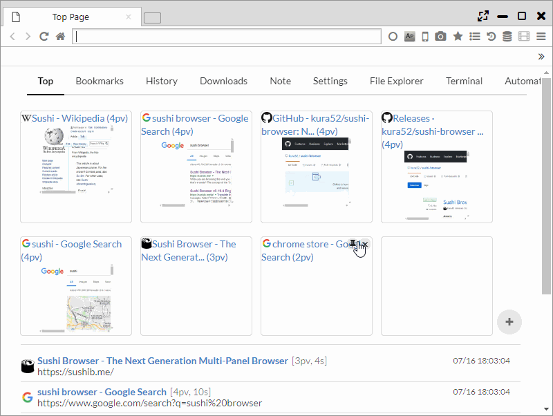

## Top Page

On the top page, the links and speed dials to all the pages being managed and the latest history are displayed.

*********

### 1. Speed Dial

The speed dial displayed on the top of the page shows the number of PVs in ascending order.   
On each site, the X button and hairpin button are displayed. If you press the X button, the PV numbers will be cleared and removed from the speed dial displayed.  

f you press the pin button , the display position will be fixed at the top. When you press the X button, you can return to normal and the links at the bottom will be shown.  

At the bottom-right side of the speed dial is a + button which you can press to add a new site to the speed dial.  
The added site will be kept in the top page folder of the bookmarks.

*********

### 2. Other

- When "Main Menu > Window SubMenu > Show bookmark bar on top page" is ON, only the bookmarks in the top page will be shown.

- At the top of the page, the following management pages' links will be shown.
    - Top Page
    - Bookmarks
    - History
    - Downloads
    - Note
    - Settings
    - File Explorer
    - Terminal
    - Automation
    - Video Converter
    
- At the lower part of the screen the latest browsing history is displayed. 
