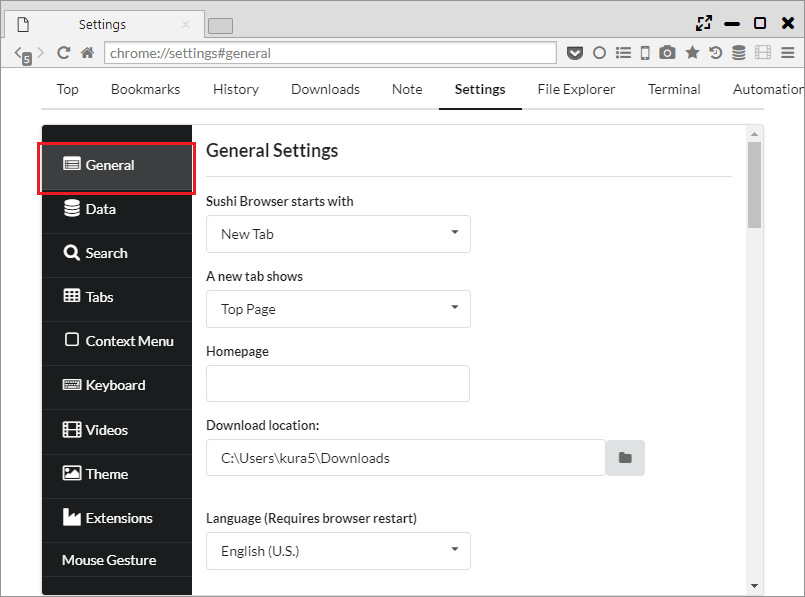

## Various Settings

Basic settings and the configuration of unique items can be carried out from "Settings > General".   

*********

### 1. Settings

- Sushi Browser starts with  
- A new tab shows  
- Homepage
- Download location

- Language (Requires browser restart)

- Autocomplete data (Requires browser restart)
    - Order of AutoComplete ・・・ "Suggestion by search engine → History" or "history → suggestion by search engine"
    - Number of Suggestions ・・・ Set the number of "Suggest by search engine" display
    - Number of Histories ・・・ Set the number of suggestion by "history" to be displayed
    - Sort history in descending order of PV ・・・ Arrange the order of sorting by "history" in ascending order of page views (usually in the order of newest date)

- Zoom (Requires browser restart) ・・・ Configure the amount of change in the zoom percentage

- Default Sidebar Position ・・・ Configure the default location of the sidebar icon on the menu bar after it is clicked 

- Open Link in New Tab (Requires browser restart)  
    - SideBar Link  
    - ToolBar Link  
    - AddressBar Link  
    - BookmarkBar Link

- Special Behavior  
    - Show Chrome Extension Icon on Toolbar(Requires browser restart) ・・・ Configure whether the Chrome expansion icon will be displayed on the tool bar or on the background bar 
    - Enable Mouse Gesture(Requires browser restart)  ・・・ Set on and off of mouse gesture
    - Show Back/Forward Button's Badget (Requires browser restart) ・・・ Set if icon of value under right of the button of return and go forward is shown or not.
    - Show Focus Location Bar of Top Page ・・・ Set if focus location bar is shown or not on top page.
    - Enable Bottom Download List (Requires browser restart) ・・・ Set if downloading list shown at the bottom edge is shown or not when downloading starts.
    - Enable behavior change when long press of middle mouse button (Requires browser restart) ・・・ Set if action is changed in case where middle click of the mouse is pushed for a long time.
    - Enable horizontal position moving (When you triple left clicking) ・・・ Set if it is scrolled horizontally at the position where it is clicked if we click 3 times.
    - Enable anything search (When you double pressing the shift key) (Requires browser restart)　・・・ Set if search bar is shown if we push shift twice.

- Send URL to external media player  

- Concurrent Download(0 means no limit) ・・・ Configure the number of files that will be simultaneously parallel downloaded 
- Max number of connections per item (Parallel Download) ・・・ Number of separate downloads  

- Custom Window Icon(Requires browser restart) ・・・ Window icon settings 

- Sync Scroll Margin(Requires browser restart) ・・・　Configure the margin of the next panel during synchronized scrolling 

- Bind Window Frame Margin
- Bind Window Title Margin
