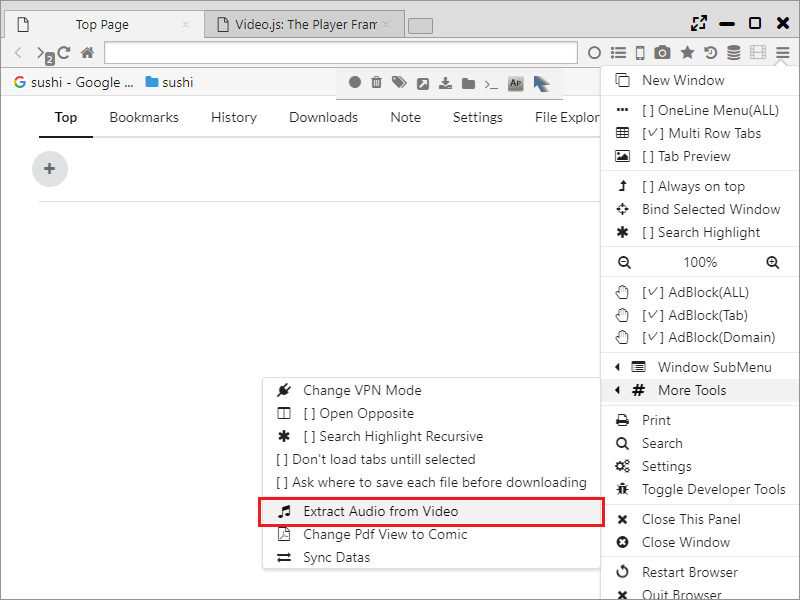
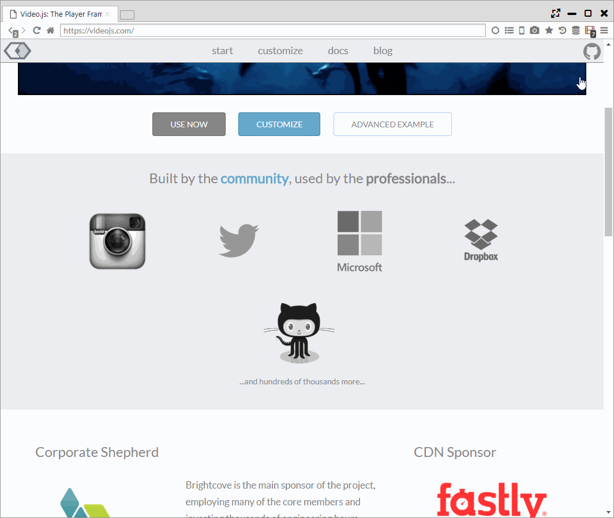

##Video Support Function

Sushi Browser has support functions for such as video downloading and mouse operation,
it can be used as a video playback browser.  
*For video download, please do no not violate the terms of the Web service and use at your own risk.

*********

### 1. Video download  

**・Video detection**  
When a video is detected on the web page, the video icon on the tool bar turns red.  
When you click the video icon, it display the list and you can perform the following operations.   
 (A) Click on the item on the list: The video starts downloading.  
 (B) :fa-play:： Videos will be played with built-in player (using [videojs](https://videojs.com/)).  
 (C) :fa-play-circle:： At the same time as downloading the video, the video starts playing with the specified video player when 5% of video is download. (Recommended)  
 (D) :fa-play-circle-o:： Video starts playing on the external video player that being set on the setting page.  
 (E) :fa-download:： Save the video with a new name.  
 (F) :fa-industry:：  Passe the data to the built-in video converter (using handbreak) in Sushi Browser After saving the video.  
 (E) :fa-music:： Extract and save the audio data after saving the video.  
 (G) Clipboard icon: Save the video URL to the clipboard.
  
 

Also, by right clicking on the video URL and select "Save and Play Video", it performs the same operation as (C).   
 
 

**・Video streaming (.m3u8)**  
You can download HLS streaming videos (.m3u8) by using the function of [youtube-dl](https://rg3.github.io/youtube-dl/). 
When you click the video icon, the list is displayed and you can perform the following operations. 
 (A) Click on the item on the list: Downloading of the video starts by using youtube-dl and Terminal function.  
 (B) :fa-play-circle-o:： Video starts playing on the external video player set on setting page.   
 (C) :fa-download:： Save the video with a new name.  
 (D) Clipboard icon: Save the URL of the video on the clipboard.  

**・Batch downloading (extracting videos with youtube-dl)**  
You can do butch download using Sushi Browser downloader function.  
By enabling "Attempt to find and download video (Using youtube-dl)", you can detect and download videos from the target URL using youtube-dl.  

*********

### 2. Pop-up window, panel
If you select the following from the context menu right clicked on the movie being played or the menu displayed after clicking the movie icon, the movie will be cut out as a popup window or panel.

- Play Video in Popup Window
- Play Video in Floating Panel

*********

### 3. Mouse, keyboard operation
Varieties of control and setting are possible with mouse and keyboard like movie player onto the movies being played.   
Mouse wheel control is assigned to Seek, Double-click is assigned to full screen mode as default.  
You can also adjust volume by Ctrl + mouse wheel.  

You can set each operation with "Settings> Videos".

*********

### 4. Mute, adjusting volume
While you are watching videos, you can toggle mute by clicking Volume icon on the tab.  
Mouse over onto the volume icon to show the volume bar, you can change the volume of the targeted tab up to **800%**.  

*********

### 5. Sending a URL to an external player 

Just like in "1. Video download", the video's URL can be set to an external player that you have configured.   
It can be configured with the "Send URL to external media playe" of "ettings > General".   

*********

### 6. Voice extraction, video conversion 

Just like what is recorded in "1. Video download" it is possible to do voice extracrion or video conversion while downloading videos at the same time.  
In addition, it can also run voice extraction on a local file from the main menu. 

