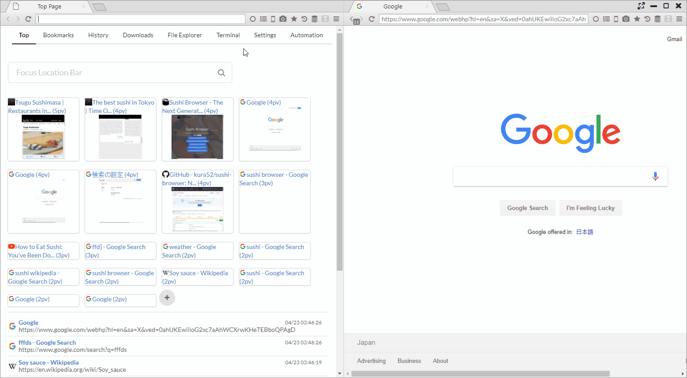
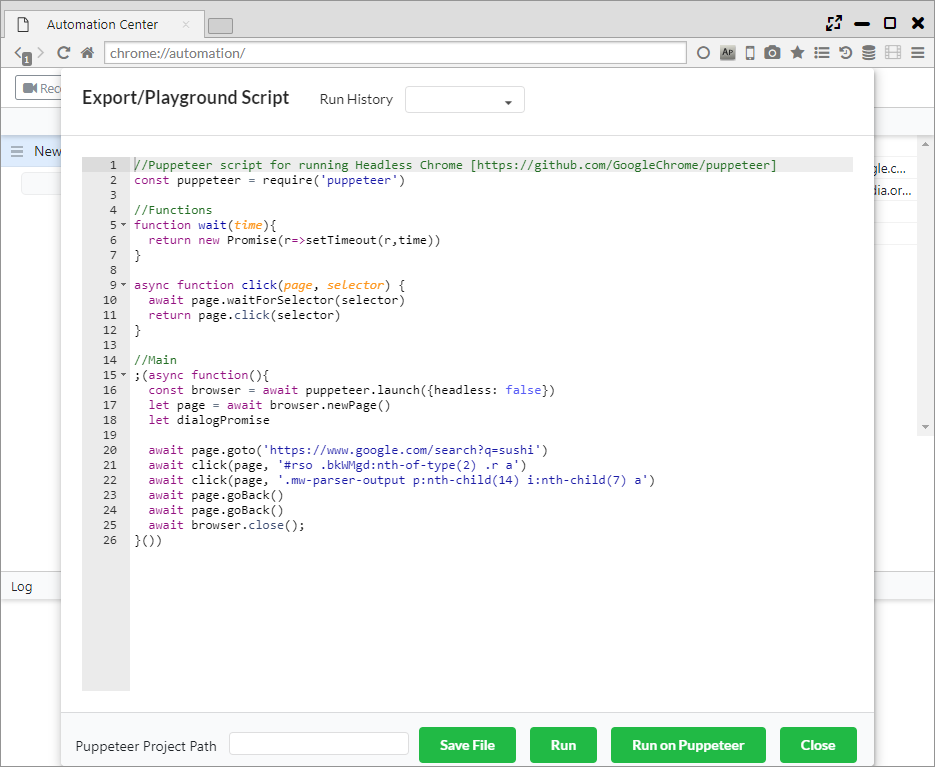
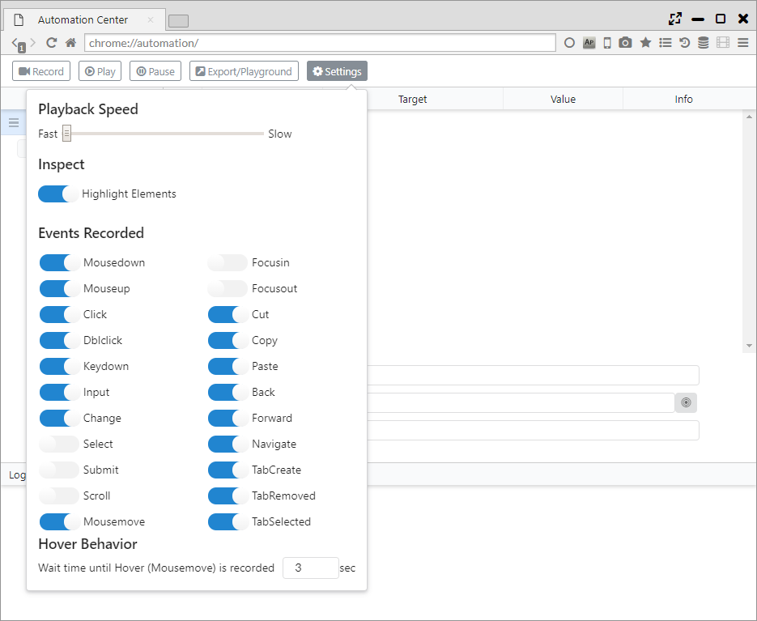

## Automation

iMacrosやSelenium IDEのような自動操作補助機能で、
Puppeteer(ヘッドレスChromeでの自動化) APIと互換性のあるAPIを実装しています。

*********

### 1. 操作の記録

画面上部のRecordボタンをクリックすると操作の記録が開始されます。  
記録したい操作を一通り実施した後に、Record Stopボタンをクリックすると記録が終了します。

Projectパネルの1行が記録の保存単位になります。  

記録した操作は以下の項目で画面表示されます。

- Command ・・・ 記録したコマンド（イベント）
- Target ・・・ 処理対象のCSSセレクタ
- Value ・・・ 操作に使用される値
- Info ・・・ その他の情報

*********

### 2. 記録した操作の再生

Playボタンをクリックすると、記録した操作が再生されます。

Pauseボタンをクリックすることで、再生を一時停止することができます。

*********

### 3. 記録のエクスポート、PlayGround

Export/Playgroundボタンをクリックすると、自動操作のスクリプトが表示されます。  
このスクリプトはPuppeteerで実行できるスクリプトとなっています。

ポップアップ下部のボタンから以下の操作が行えます。

- Save File ・・・ スクリプトをJSファイルに保存します
- Run ・・・ スクリプトをSushi Browser上で実行します
- Run on Puppeteer ・・・「Puppeteer Project Path」で指定されたプロジェクトのPuppeteer上でスクリプトを実行します
- Close ・・・ ポップアップウインドウをクローズします

*********

### 4. 設定

- Playback Speed ・・・ スクリプトの再生速度の設定
- Highlight Elements ・・・ スクリプト記録時に要素をハイライトするか否かの設定
- Events Recorded ・・・ 記録するイベントを選択
- Hover Behavior ・・・ マウスオーバーとしてレコードされるまでの待機時間を設定

