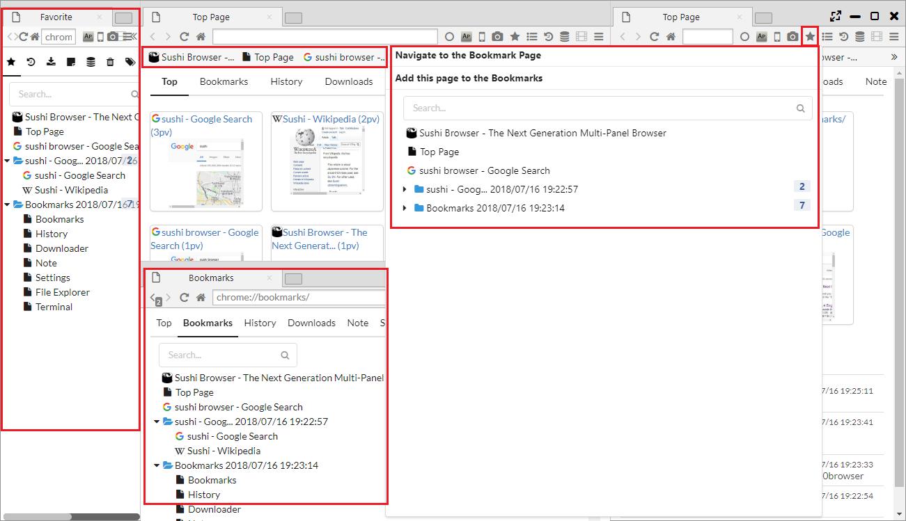

## ブックマーク

Top Page、メニューバー、サイドバー、ブックマークバーからブックマークにアクセスできます。

*********

### 1. ブックマークページ

メニューバー、サイドバーからアクセスするブックマークページでは、以下の操作が行えます。

- ドラッグアンドドロップによる移動
- 上部の検索ボックスからの検索
- 右クリックメニューによる操作
    - 新しいタブで開く
    - 新しいプライベートタブで開く
    - Open Link in New Tor Tab
    - 新しいセッションタブで開く
    - 新しいウインドウで開く
    - Open Link in New Window with a Row ・・・ 新しいウインドウにパネルを横に並べて複数のリンクを開きます
    - Open Link in New Window with two Rows ・・・ 新しいウインドウにパネルを2行に並べて複数のリンクを開きます
    - 編集
    - コピー ・・・ URLをコピーします
    - 削除
    - ブックマークを追加
    - フォルダーを追加
      
Top Pageからアクセスされるブックマークページは、編集を目的としており、
Webページを開く場合は、サイドバーのブックマークと異なり、項目をダブルクリックする必要があります。

*********

### 2. ブックマークバー

ブラウザ上部に表示されるバーで、デフォルトでは、Top Pageでのみ表示されます。  

- 「メインメニュー > Window SubMenu > ブックマーク バーを常に表示」を選択すると、常にブックマークバーが表示されます。  
- 「メインメニュー > Window SubMenu > Show bookmark bar on top page」を選択すると、Top Pageでのブックマークバーの表示有無が変更されます。 
- 「メインメニュー > Window SubMenu > Show bookmark bar on mouse hover」を選択すると、画面上部にマウスカーソルを移動するとブックマークバーが表示されます。

