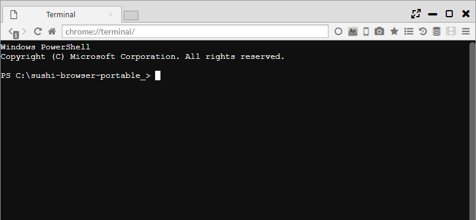
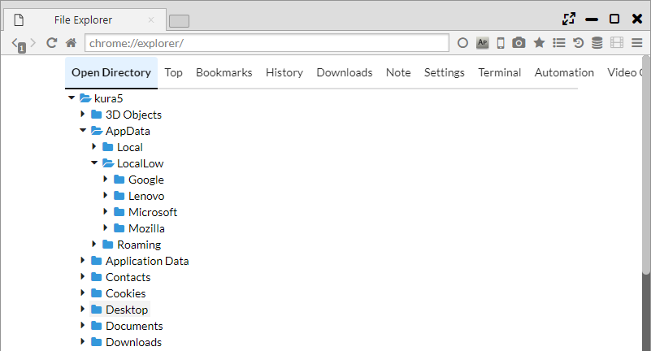
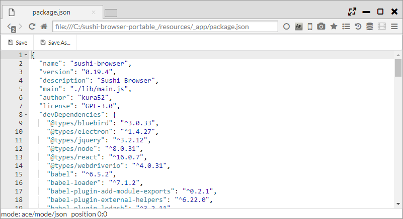
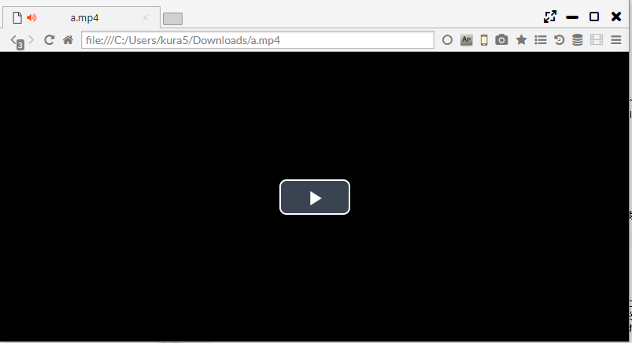

## ビルドインツール

Terminal機能、File Explorer、ビルドイン動画プレイヤー、ビルドインテキストエディタが利用できます。

*********

- Terminal：bashやPowerShellなどのシェル操作ができます。
- File Explorer：ファイル操作や閲覧ができます。
- ビルドイン動画プレイヤー：自動再生の動画機能が利用できます。
- ビルドインテキストエディタ：テキストやソースコードの編集ができます。

