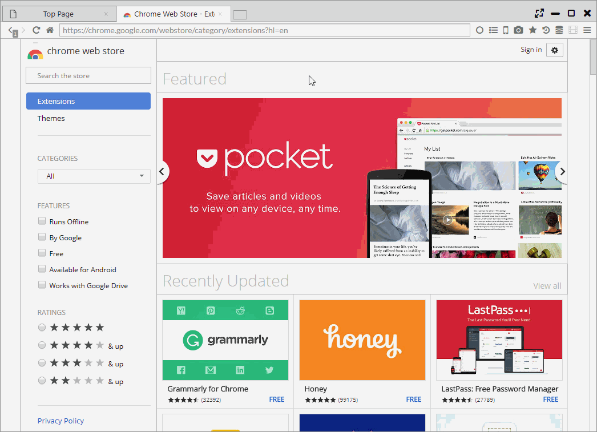

## Chrome拡張

本ブラウザでは、Chrome拡張を部分的にサポートしています。また、一部のFirefoxアドオン(WebExtension)も利用できます。  

*********

### 1. インストール・設定

[Chrome拡張](https://chrome.google.com/webstore/category/extensions)、[Firefoxアドオン](https://addons.mozilla.org/)のインストールは公式Webサイトから行えます。

「設定 > 拡張機能」からインストール済みの拡張に対して、有効無効の制御、削除が行なえます。オプションの歯車アイコンを押すと、設定ページに移動します。

*********

### 2. インストール先
インストーラ版では、以下のフォルダにChrome拡張がインストールされます。

- Windows: C:\Users[Name]\AppData\Roaming\sushiBrowser\resource\extension
- MacOS: /Users/[Name]/Library/Application Support/sushiBrowser/resource/extension
- Linux: ~/.config/sushiBrowser/resource/extension/

ポータブル版では、解凍したフォルダの「data/resource/extension」配下に保存されます。

*********

### 3. 使用可能なChrome API
以下のAPIの一部または全てが利用可能です。

- chrome.bookmarks
- chrome.browserAction
- chrome.browsingData
- chrome.commands
- chrome.contentSettings
- chrome.contextMenus
- chrome.cookies
- chrome.downloads
- chrome.extension
- chrome.history
- chrome.i18
- chrome.idle
- chrome.notifications
- chrome.pageAction
- chrome.proxy
- chrome.runtime
- chrome.sessions
- chrome.storage
- chrome.tabs
- chrome.topSites
- chrome.webNavigation
- chrome.webRequest
- chrome.windows

未対応のAPIは以下になります。

- chrome.accessibilityFeatures
- chrome.alarms
- chrome.certificateProvider
- chrome.debugger
- chrome.declarativeContent
- chrome.desktopCapture
- chrome.devtools
- chrome.documentScan
- chrome.enterprise
- chrome.events
- chrome.fileBrowserHandler
- chrome.fileSystemProvider
- chrome.fontSettings
- chrome.gcm
- chrome.identity
- chrome.instanceID
- chrome.management
- chrome.networking
- chrome.omnibox
- chrome.pageCapture
- chrome.permissions
- chrome.platformKeys
- chrome.power
- chrome.printerProvider
- chrome.privacy
- chrome.system
- chrome.tabCapture
- chrome.tts
- chrome.ttsEngine
- chrome.types
- chrome.vpnProvider
- chrome.wallpaper
- chrome.webstore
