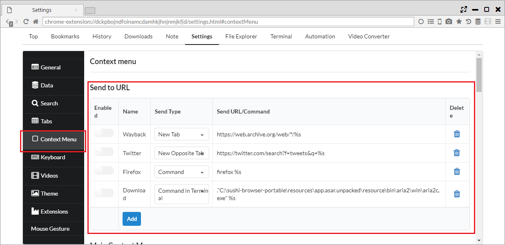

## 右クリックメニュー

他のブラウザで用意されている右クリックメニューに加えて、本ブラウザでは独自の様々なメニューを実装しています。

*********

### 1. URLを転送
「設定 > コンテキスト メニュー > Send to URL」リンクのURLを編集して送信することや、
外部のアプリケーションに渡すことができます。

「Send Type」で送信先を決定できます。

- New Tab ・・・ 新しいタブで設定したURLを開きます。
- New Opposite Tab ・・・ 対面パネルで設定したURLを開きます。
- Command ・・・ 設定したコマンドを実行します
- Command in Terminal ・・・ 設定したコマンドをターミナル内で実行します

「Send URL/Command」で送信するURLまたはコマンドを設定することができます。%sの部分が、実際のURLに置き換わります。

*********

### 2. 右クリックメニュー設定

「設定 > コンテキスト メニュー > ページのコンテキストメニュー」から右クリックメニューへの表示有無を設定できます。

 - 戻る
 - 進む
 - 再読み込み
  

 - 「」を検索 ・・・ テキストを選択した場合やリンクテキストに対して、検索を行います
 

 - Copy Links ・・・ 選択したリンクをすべてコピーします
 - 選択範囲のリンクを新しいタブで開く ・・・ 選択したリンクをすべて新しいタブで開きます
 - Download Selection ・・・ 選択したリンクをダウンローダに渡します
 - 名前を付けてページを保存
 - このページをブックマーク
 

 - 印刷
 

 - このページを翻訳 ・・・ 現在のページをGoogle翻訳で対面パネルに開きます
 - Download All ・・・ ページ内のリンク/メディアをダウンローダに渡します
  

 - Sync Scroll Left to Right ・・・ 左から右へ同期スクロールを行います
 - Sync Scroll Right to Left ・・・ 右から左へ同期スクロールを行います

 
 - ページのソースを表示
 - 要素を検証
 

 - 新しいタブで開く
 - Open Link in Opposite Tab ・・・ リンクを対面パネルで開きます
 - 新しいウィンドウで開く
 

 - 保存
 - 名前を付けてリンクを保存
 

 - リンクのアドレスをコピー
 - リンクテキストをコピー
 

 - Save and Play Video ・・・ リンク先のビデオを保存と同時にデフォルトのプレイヤーで再生します
 - Send URL to Video Player ・・・ 外部プレイヤーにURLを送ります
 

 - 切り取り
 - コピー
 - 貼り付け
 

 - 画像を新しいタブで開く
 - 画像を保存
 - 画像をコピー
 - 画像のアドレスをコピー
 

 - ループ ・・・ 動画をループします
 - Muted ・・・ 動画をミュートにします
 - コントロールを表示
 - Play Video in Popup Window ・・・ 動画をポップアップウインドウに切り出します
 

 - 動画を新しいタブで開く
 - 名前を付けて動画を保存...
 - 動画アドレスをコピー
 

 - オーディオを新しいタブで開く
 - 名前を付けてオーディオを保存...
 - オーディオ アドレスをコピー
 

 