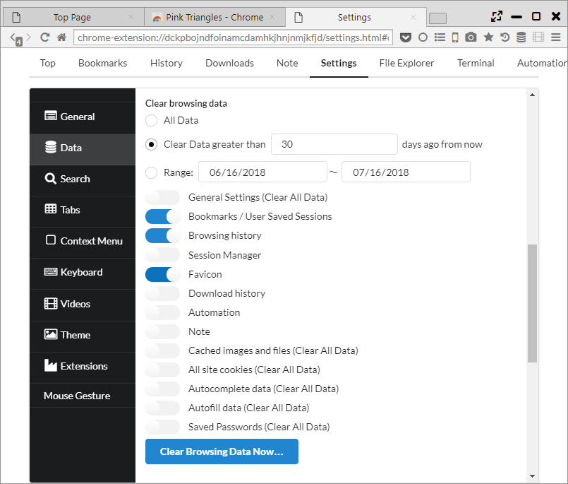

## データのインポート、エクスポート

「設定 > Data」から他のブラウザからのデータインポートや、各種データのエクスポート/インポートが行なえます。

*********

### 1. ブラウザーデータをインポート

インポートボタンを押すと、「Import Browser Data」ダイアログが表示され、Edge, IE, Chrome, Firefoxから以下のデータがインポートできます。  

- Browser History
- Bookmarks
- Cookies
- Passwords

※インポート元のブラウザが起動していると、インポートできないデータがあるため、終了させてから実行ください。

また、HTMLファイル形式のブックマークもインポート可能です。

*********

### 2. ブックマークをエクスポート

エクスポートボタンを押すと、HTML形式でブックマークをエクスポートします。

*********

### 3. 設定をインポート、エクスポート

JSON形式で以下のデータをインポート、エクスポートできます。  
インポートする場合は、全データ入れ替えとなるため注意ください。

- 一般設定
- ブックマーク
- 閲覧履歴
- セッションマネージャ
- Favicon
- ダウンロード履歴
- Automation
- Note

*********

### 4. データの消去

即時のデータ削除と、ブラウザ終了時のデータ削除ができます。

以下の3パターンで削除データの範囲を設定できます。

- All Data ・・・ 全データが削除されます。
- Clear Data Greater than [N] days ago from now ・・・ 現在からN日より前のデータを削除します。
- Range ・・・ 指定された日付の範囲のデータを削除します。

以下のデータが削除可能で、「Clear All Data」と記載のある項目は範囲指定が効かず全データが削除されます。

- 一般設定 (Clear All Data)
- Bookmarks / User Saved Sessions
- 閲覧履歴
- セッションマネージャ
- Favicon
- ダウンロード履歴
- Automation
- Note
- キャッシュされた画像とファイル (Clear All Data)
- 全てのサイトのクッキー (Clear All Data)
- オートコンプリートのデータ (Clear All Data)
- 自動入力のデータ (Clear All Data)
- 保存したパスワード (Clear All Data)

