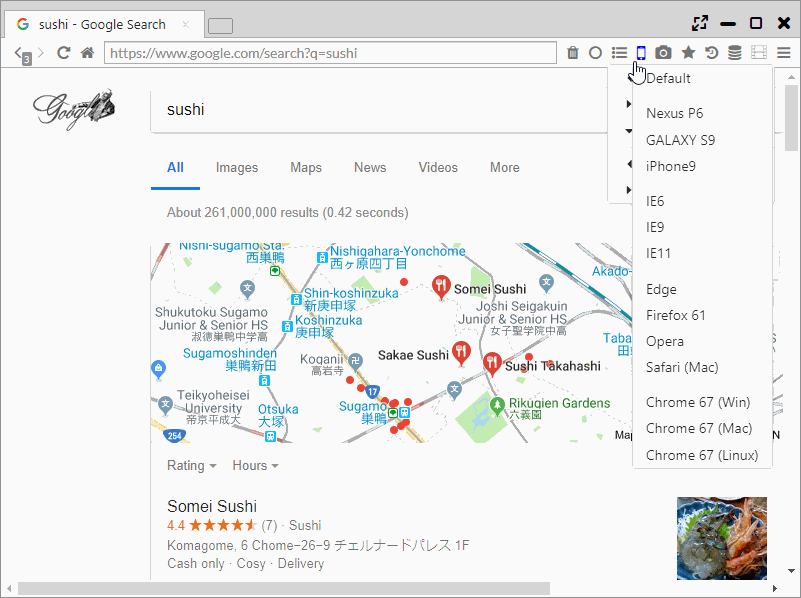

## 表示切り替え、ウインドウ固定

常に手前に表示、ウインドウをパネルに固定、モバイル表示(ユーザエージェント変更)など様々な機能があります。

*********

### 1. 別ウインドウを固定 (Windows、Linuxのみ)

本ブラウザ独自機能で、他アプリケーションのウインドウをブラウザのタブに対して固定化し、
1つのタブ内のアプリケーションのように制御する機能になります。  

動画プレイヤーやテキストエディタを固定化し、並行して作業を行うなどの利用方法を想定しています。

「メインメニュー > Bind Selected Window」を選択し、固定化したいアプリケーションをクリックすると、
固定化が開始されます。タブを閉じると固定化が解除されます。

*********

### 2. 常に手前に表示

「メインメニュー > 常に手前に表示」を選択すると、対象のウインドウが最上面に表示されます。

*********

### 3. モバイル表示(ユーザエージェント変更)

メニューバー上の携帯アイコンをクリックすることで、ページ表示をモバイル表示に変更できます。  
また、モバイル表示以外のUser Agentにも変更することが可能で、以下のUser Agentを利用できます。

- Nexus P6
- Galaxy S9
- iPhone
- IE6
- IE9
- IE11
- Edge
- Firefox 61
- Opera
- Safari (Mac)
- Chrome 67 (Win)
- Chrome 67 (Mac)
- Chrome 67 (Linux)

