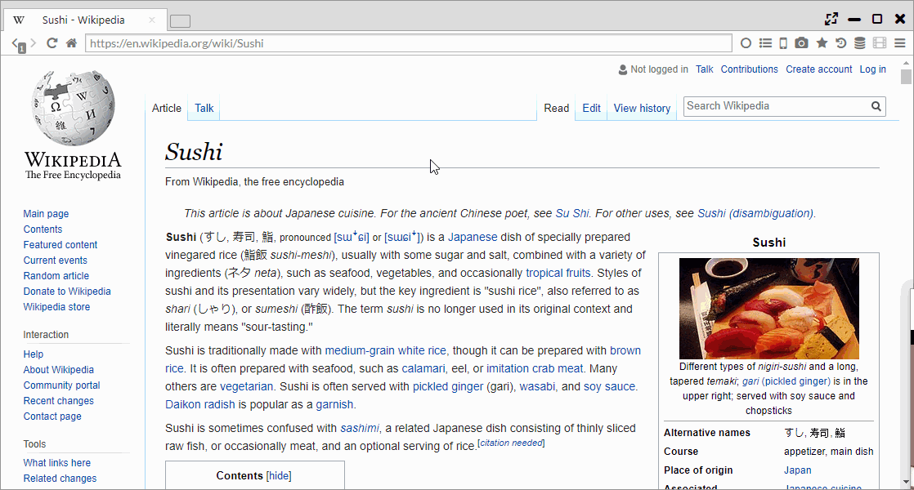

## ダウンローダー

高速ダウンロードライブラリのAria2cを利用したダウンロード機能を搭載しています。
最大16並列のダウンロードや、レジューム機能を備えています。  
加えて、FirefoxのDownThemALl!のように右クリックでページ中のリンク・画像・動画を一括ダウンロードできます。
また、ダウンローダーのページから複数のURLを指定して、一括ダウンロードも可能です。

*********

### 1. 並列ダウンロード	

ダウンローダーのページの「Downloads per server」で並列ダウンロード数を設定できます。

*********

### 2. ページ内ダウンロード（Download All）	

ページ内で右クリックし、「Download All」を選択することで、ページ内のリンクやメディアファイルの一括ダウンロードが可能です。

また、テキストを選択し、「Download Selection」を選択することで、選択範囲内のリンクの一括ダウンロードが可能です。

*********

### 3. 一括ダウンロード	

ダウンローダページ(chrome://download/)の「New DL」ボタンを押したあとに起動するダイアログでは、
ワイルドカード展開を利用した連番ダウンロードやファイル名への日付情報の付加などができます。
