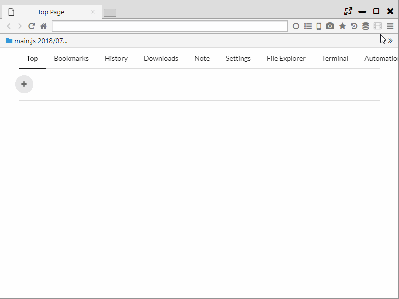

## ページ内検索

ページ内検索では、Chromeの検索機能に加え、OR検索と正規表現による検索が行えます。
また、ハイライト検索機能も備えています。

*********

### 1. 検索オプション

「CtrlまたはCmd+F」を押すか、「メインメニュー > 検索」を選択することで、ページ内検索が開始します。  
検索には以下のオプションを利用することができます。

- Case ・・・ 大文字・小文字を区別してマッチする
- OR ・・・ スペース区切りでOR検索を行う
- Reg ・・・ 正規表現による検索を行う

*********

### 2. ハイライト検索

ハイライト検索とは、検索エンジンの検索ワードを自動でページ内検索を行う機能になります。

「メインメニュー > Search Highlight」をONにすると、
検索エンジンのページとその次のページまで検索ワードがハイライトされます。

「メインメニュー > その他のツール > Search Highlight Recursive」をONにすると、
検索後の全ページがハイライト検索の対象になります。
