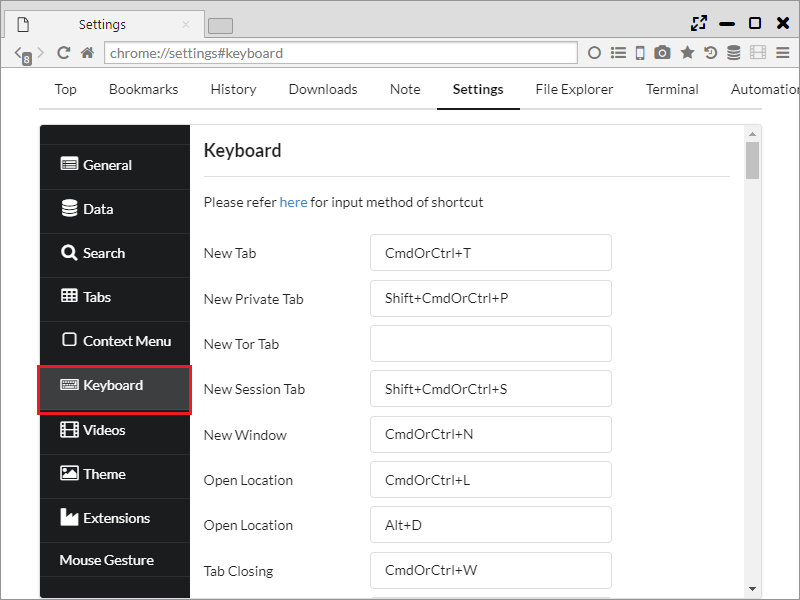

## キーボードショートカット

100を超える機能に対して、キーボードショートカットを設定することができます。

*********

### 1. 設定
「設定 > キーボード」から設定が行なえます。

キーの入力方法は、[リンク先](https://github.com/electron/electron/blob/master/docs/api/accelerator.md)に記載があるとおりで、
例えば以下のパターンがあります。  

- Ctrl+T　・・・ Ctrlを押しながらtキーを押す
- Alt+@ ・・・ Altキーを押しながら@キーを押す
- Space ・・・ スペースキー

設定可能な操作は以下になります。

 - 新しいタブ (CmdOrCtrl+T)
 - 新しいウィンドウ (CmdOrCtrl+N)
 - 場所を開く (CmdOrCtrl+L Alt+D)
 

 - タブを閉じる (CmdOrCtrl+W)
 - ウィンドウを閉じる (CmdOrCtrl+Shift+W Ctrl+F4)
 - すべてのタブを閉じる (CmdOrCtrl+Alt+C)
 - 他のタブを閉じる (Shift+CmdOrCtrl+O)
 - 左側のタブを閉じる
 - 右側のタブを閉じる
 

 - 名前を付けてページを保存 (CmdOrCtrl+S)
 - 印刷 (CmdOrCtrl+P)
 - Restart Browser
 - Sushi Browserを終了 (CmdOrCtrl+Q)
 
 

 - ページ内検索 (CmdOrCtrl+F F6)
 - 等倍 (CmdOrCtrl+0)
 - 拡大 (CmdOrCtrl+= CmdOrCtrl+Shift+=)
 - 縮小 (CmdOrCtrl+- CmdOrCtrl+Shift+-)
 

 - ページを再読み込み (CmdOrCtrl+R F5)
 - キャッシュを破棄して再読み込み (CmdOrCtrl+Shift+R Ctrl+F5)
 - すべてのタブを再読み込み (CmdOrCtrl+Alt+R)
 - 他のタブを再読み込み (CmdOrCtrl+Alt+O)
 - 左側のタブをすべて再読み込み (CmdOrCtrl+Alt+L)
 - 右側のタブをすべて再読み込み (CmdOrCtrl+Alt+I)
  

 - 開発者ツールを表示 (Ctrl+Shift+I CmdOrCtrl+Alt+J F12)
 - 全画面表示 (F11)
 - ホーム (CmdOrCtrl+Shift+H)
 - 戻る (CmdOrCtrl+[ Alt+Left)
 - 進む (CmdOrCtrl+] Alt+Right)
 - 最後に閉じたタブを開く (Shift+CmdOrCtrl+T)
 - [最近閉じたタブ] をすべて開く (Shift+CmdOrCtrl+A) ・・・ 当該パネルで閉じたタブがすべて開かれます
 

 - すべてのタブをブックマークに追加する (Shift+CmdOrCtrl+B)
 - ブックマーク (Ctrl+Shift+O) ・・・ ブックマークページを開く
 - このページをブックマーク (CmdOrCtrl+D)
 

 - 履歴を表示 (CmdOrCtrl+Y)
 - Open Note ・・・ Noteページを開く
 - 設定 (CmdOrCtrl+,) ・・・ 設定ページを開く
 - Open FileExploler ・・・ FileExplolerページを開く
 - Open Terminal ・・・ Terminalページを開く
 - Open Automation ・・・ Automationページを開く
 - Open VideoConverter ・・・ VideoConverterページを開く
  

 - ページのソースを表示 (Ctrl+U)
 - 最小化 (CmdOrCtrl+M)
  

 - 次のタブを選択 (Ctrl+Tab CmdOrCtrl+Shift+] Ctrl+PageDown)
 - 前のタブを選択 (Ctrl+Shift+Tab CmdOrCtrl+Shift+[ Ctrl+PageUp)
 - タブ 1 (CmdOrCtrl+1)
 - タブ 2 (CmdOrCtrl+2)
 - タブ 3 (CmdOrCtrl+3)
 - タブ 4 (CmdOrCtrl+4)
 - タブ 5 (CmdOrCtrl+5)
 - タブ 6 (CmdOrCtrl+6)
 - タブ 7 (CmdOrCtrl+7)
 - タブ 8 (CmdOrCtrl+8)
 - 最後のタブ (CmdOrCtrl+9)
 - Multi Row Tabs ・・・ 多段タブを切り替えます
 - Tab Preview ・・・ タブプレビューを切り替えます
  

 - Toggle MenuBar (CmdOrCtrl+Alt+T) ・・・ One Lineモードに切り替えます
 - Change Focus Panel (CmdOrCtrl+Alt+Space) ・・・ パネルのフォーカスを移動します
 - Split Left (CmdOrCtrl+Alt+Left) ・・・ パネルを左側に分割
 - Split Right (CmdOrCtrl+Alt+Right) ・・・ パネルを右側に分割
 - Split Top (CmdOrCtrl+Alt+Up) ・・・ パネルを上側に分割
 - Split Bottom (CmdOrCtrl+Alt+Down) ・・・ パネルを下側に分割
 - Split left tabs to left ・・・ 現在のタブより左のタブを左側のパネルに分割
 - Split right tabs to right ・・・ 現在のタブより右のタブを右側のパネルに分割
  

 - Swap Position (CmdOrCtrl+Alt+P) ・・・ パネルの位置を入れ替え
 - Switch Direction (CmdOrCtrl+Alt+D) ・・・ パネルの方向を入れ替え
 - Align Horizontal (CmdOrCtrl+Alt+H) ・・・ 水平方向に整列
 - Align Vertical (CmdOrCtrl+Alt+V) ・・・ 垂直方向に整列
 - Switch Sync Scroll (CmdOrCtrl+Alt+S) ・・・ 同期スクロールを切り替え
 - Open Sidebar (CmdOrCtrl+Alt+B) ・・・ サイドバーを開く
 - Enable Search Highlight ・・・ ハイライト検索有無を切り替え
 - Change to Mobile Agent (CmdOrCtrl+Alt+M) ・・・ モバイルモードへ切り替え
 - Detach Panel (CmdOrCtrl+Alt+E) ・・・ パネルを別ウインドウに分離
  

 - タブの URL をコピー
 - クリップボードの URL を開く (CmdOrCtrl+Alt+U)
 - Paste and Open (CmdOrCtrl+Alt+N) ・・・ 新しいタブでクリップボードのURLを開く(改行区切りで複数のURLを開くことも可能)
 - Copy Tab Info ・・・ タブの情報(番号、URL、タイトル)をコピー
 - Copy All Tab Titles ・・・ 全タブのタイトルをコピー
 - Copy All Tab URLs ・・・ 全タブのURLコピー
 - Copy All Tab Infos  ・・・ 全タブの情報(番号、URL、タイトル)をコピー
  

 - タブを複製
 - タブを固定 ・・・ タブを左端に寄せ、faviconのみ表示
 - タブをミュート
 - タブを凍結 ・・・ タブを保護、タブをロックの両方を実施
 - タブを保護 ・・・ タブのクローズを不可とする
 - タブをロック ・・・ 対象タブのリンクを全て新しいタブに開く 
 

 
 - ダウンロード (Ctrl+J) ・・・ ダウンローダーページを開く
  

 - Full Page Capture to Clipboard ・・・ ページ全体のスクリーンショットをクリップボードに保存
 - Full Page Capture as JPEG ・・・ ページ全体のスクリーンショットをJPEGで保存
 - Full Page Capture as PNG ・・・ ページ全体のスクリーンショットをPNGで保存
 - Selection Capture to Clipboard ・・・ 選択範囲のスクリーンショットをクリップボードに保存
 - Selection Capture as JPEG ・・・ 選択範囲のスクリーンショットをJPEGで保存
 - Selection Capture as PNG ・・・ 選択範囲のスクリーンショットをPNGで保存
  

 
 - Sushi Browserを隠す (Command+H)
 - 他を隠す (Command+Alt+H)
