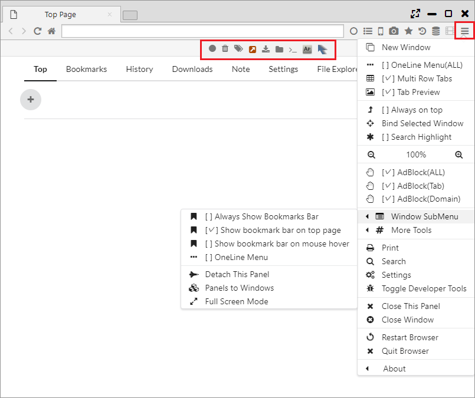
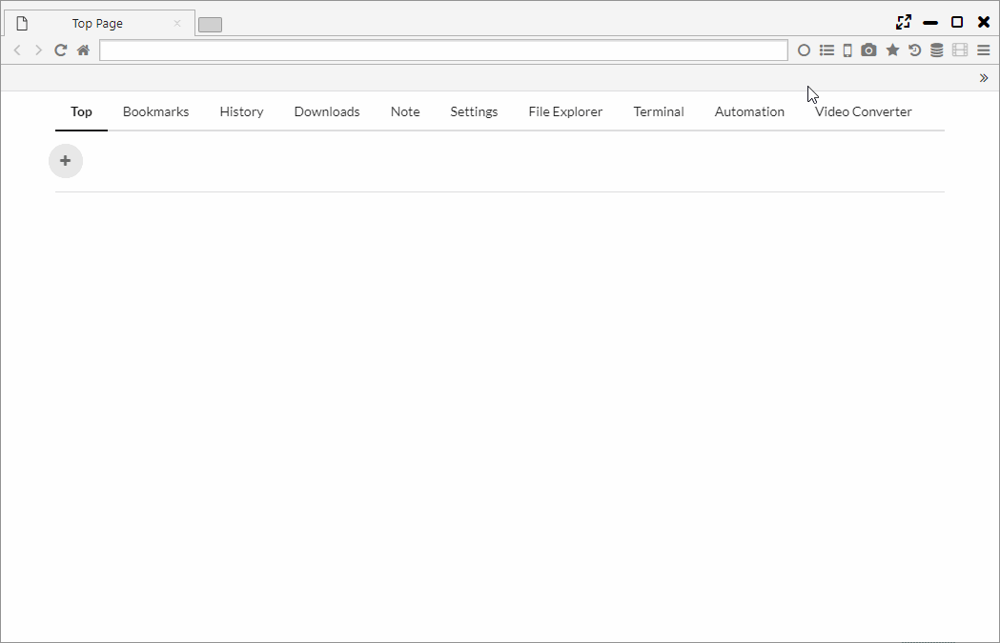

## メインメニュー、メニューバー

メインメニューおよびメニューバーについて説明します。

*********

### 1. メインメニュー

- 新しいウィンドウ
 

- OneLine Menu(ALL) ・・・ One Lineモードに切り替えます
- Multi Row Tabs ・・・ 多段タブを切り替えます
- Tab Preview ・・・ タブプレビューを切り替えます
 

- 常に手前に表示
- Bind Selected Window ・・・ 別のウインドウをパネルに固定する
- Search Highlight ・・・ ハイライト検索有無を切り替え
 

- (-) 100% (+) ・・・ ズーム率の変更
 

- AdBlock(ALL) ・・・ AdBlockの切り替え
- AdBlock(Tab) ・・・ TabごとのAdBlockの切り替え
- AdBlock(Domain) ・・・ ドメインごとのAdBlockの切り替え
 

- Window SubMenu
    - ブックマーク バーを常に表示
    - Show bookmark bar on top page ・・・ ブックマークバーをTop Pageで表示する
    - Show bookmark bar on mouse hover ・・・ マウスオーバーでブックマークバーを表示する
    - OneLine Menu ・・・ 当該のパネルをOne Lineモードに切り替えます
    - Detach This Panel ・・・ パネルを別ウインドウに分離
    - Panels to Windows ・・・パネルをウインドウに分割する
    - Full Screen Mode ・・・ フルスクリーンモードに切り替え
 

- その他のツール
    - Open Opposite ・・・ 対面パネルに開くかを設定する
    - Search Highlight Recursive ・・・ ハイライト検索を再帰的に行うかの設定
    - Don't load tabs untill selected ・・・ 選択前のタブをロードしない
    - ダウンロード前に各ファイルの保存場所を確認する
 

- Extract Audio from Video ・・・ 動画から音声を抜き出す
- Change Pdf View to Comic ・・・ PDFをコミックモードで開くか設定する
- Sync Datas ・・・ データ同期をONにする
 

- 印刷
- 検索
- 設定
- 開発者ツールを表示
 

- Close This Panel
- ウィンドウを閉じる
 

- Restart Browser
- Browserを終了

- About ・・・ ブラウザのバージョン情報

*********

### 2. メニューバー
メニューバー上には、メニューアイコンとChrome拡張のアイコンが表示されます。  
また、メインメニューを表示するとバックグラウンドのメニューバーが表示されます。

メニューバー上のアイコンを右クリックし、「Sort Menu」を選択すると、メニューバー上のアイコンのソートが可能になります。  
