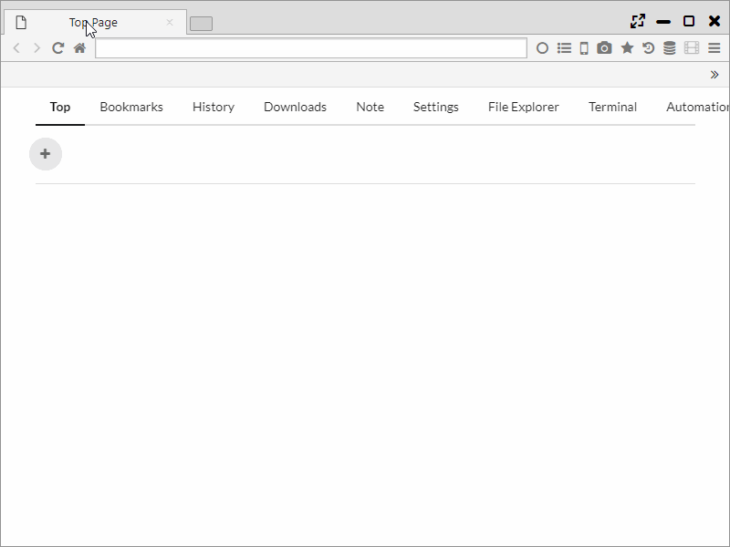
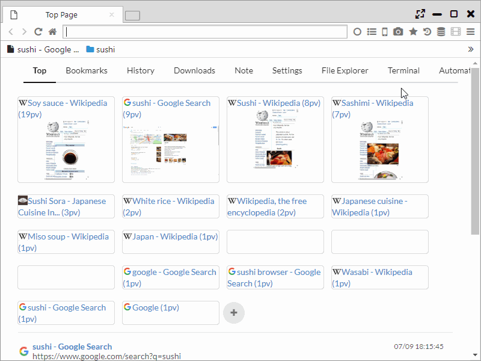
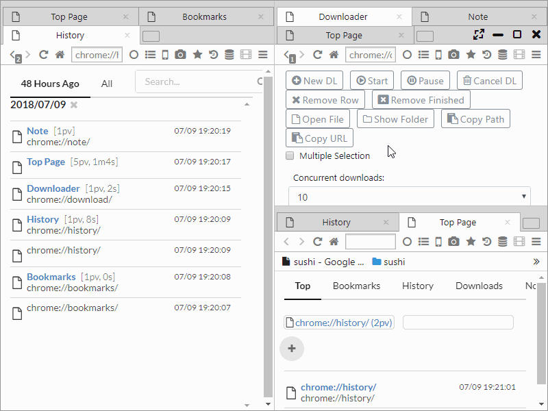
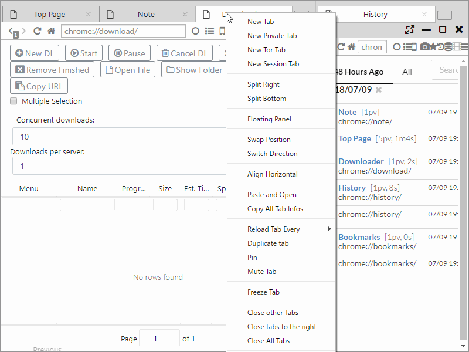

##マルチパネル

Sushi Browser最大の特徴は、マルチパネルでの表示・操作に特化していることにあります。  
複数のwebページを並べて表示するだけでなく、本ブラウザにしかない様々な機能があります。

*********

### 1. パネルを分割
タブをパネルの端にドラッグすることでパネルを分割できます。  
また、タブの右クリックメニューからもパネル分割できます。

分割したパネルは、サイズ変更もできます。

*********

### 2. 対面パネルでの表示
リンクを **中クリック(マウスホイールを押す)** することで、対面パネルにリンク先のページを開くことができます。  
１パネルの状態で **中クリックする** と、自動で２パネルに分割・表示されます。 
 
もちろん、通常のブラウザと同じくようにバックグラウンドの新しいタブで開くことも設定可能です。　  
(「メインメニュー > その他のツール > Open Opposite」で切り替えが可能です。)　

また、中クリックを長押しすると、バックグラウンドタブに開く動作に変わります。

*********

### 3. 同期スクロール
同期スクロールボタンを押すことで、本の見開き表示のようにページを並べて表示することができます。  
さらに、この状態のパネル群はスクロールやページ遷移、クローズ動作も同期され、矢印のボタンでページ送りも可能になります。

また、webページを右クリックして選べるメニューからは左から右への見開きと、右から左への見開きの両方向が選択できます。(通常は左から右)

 - Sync Scroll Left to Right ・・・ 左から右へ同期スクロールを行います
 - Sync Scroll Right to Left ・・・ 右から左へ同期スクロールを行います
 

*********

### 4. サイド(ボトム)バー
お気に入りや履歴などをサイドバーで開くことができます。サイドバーは通常と同じくwebページの表示が可能です。  
通常パネルとの違いは、ウインドウサイズを変更しても固定幅であること、同期スクロール対象でないことそれだけです。

サイドバーは「<<ボタン」を押すことで、非表示状態にすることも可能です。

*********

### 5. パネル移動
一般的なブラウザは、タブをドラッグ＆ドロップすることで、タブの移動ができます。  
本ブラウザはタブの移動に加え、「新しいタブボタン」をドラッグ＆ドロップすることで、１つのパネルの全タブを他のパネルやウインドウへ移動することができます。

*********

### 6. スリムメニュー
画面スペースを最大限に活用するために、 One Lineメニューに切り替えることができます。  
メニューバーとタブバーを統合した表示形式で、わずか30pxでのメニューを実現しています。  

*********

### 7. パネルの入れ替え・整列、方向の転換
 - ２つのパネルの位置を入れ替えることができます。  
 - 水平、垂直方向それぞれに対し、等幅に整列することができます。  
 - 横方向に並んでいるパネルを縦方向に、縦方向に並んでいるパネルを横方向に並び直すことができます。
 

*********

### 8. 同時スクロール、リンクドラッグ
 - パネルの境目でマウスホイールを動かすことで、２つのパネルを同時にスクロールできます。
 - リンクテキストを他のパネルにドラッグアンドドロップすると、リンクを開くことができます。
 

*********

### 9. 同期ページ遷移
本機能はデフォルトではページ翻訳に使用されています。  

正規表現により、ページURLを置換し、別のページを同期的に開くことができます。  
左側に通常のページ、右側にGoogle翻訳を開くようなことができます。  

入力方法は、左側にURLに対する正規表現、右側に置換後のテキストを入力します。  
左側に()を使うとキャプチャされ、$数字で置換後の内容に利用できます。($$数字でエンコードしたテキストとして使えます。)  

例えば、左側を`(.+)`、右側を`https://www.google.com/search?q=$$1`とすることで、対象のURLをGoogle検索できます。

