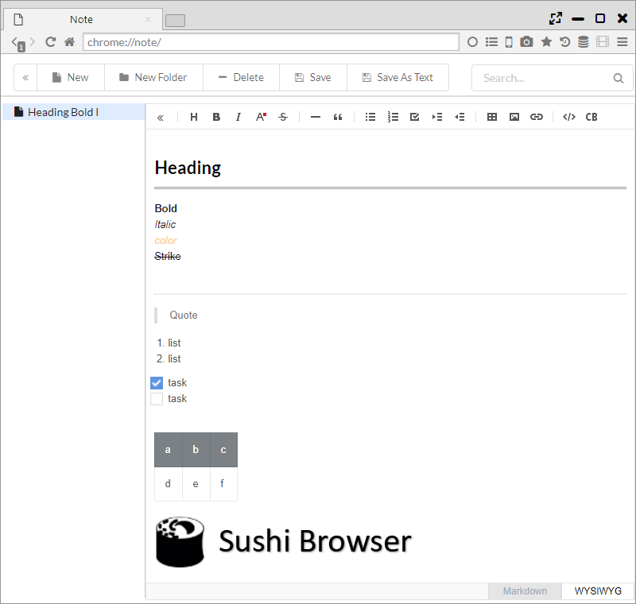

## Note

トップページまたはサイドバーから呼び出せるノート(メモ)機能があります。  
[TOAST UI Editor](http://ui.toast.com/tui-editor/)を利用しており、WYSIWYG形式（見た目通りの編集）とMarkdown形式で編集可能です。

*********

### 1. WYSIWYG形式での編集

WYSIWYGモードは、OfficeのWordに近い形の入力形態になります。  
webページや画像をコピーして貼り付けると、その書式が保持されて入力されます。  
また、入力結果は都度保存されます。  

エディター上部のツールボタンには以下の機能があります。

- Hide Sidebar ・・・ サイドバーの表示非表示を切り替え

- 見出し・・・文字サイズを見出し用に変更
- 太字
- 斜体
- 文字色変更
- 取り消し線 ・・・ 文字に取り消し線を付加

- ライン ・・・ 区切り線を挿入
- 引用 ・・・ 引用の書体に変更

- 番号なしリスト
- 順序付きリスト
- タスク ・・・ チェックボックスを追加
- インデントを増やす
- インデントを減らす

- テーブル挿入
- 画像挿入
- リンク挿入

- インラインコード
- コードブロック挿入

*********

### 2. Markdown形式での編集

Markdownモードは、Markdownでの入力とプレビューの表示機能があります。  
エディター上のツールバーに以下の2ボタンが追加されます。
- プレビューモード変更 ・・・ TabとVerticalのプレビューモードを切り替え
- 行折りたたみ変更 ・・・ 行をウインドウの端で折りたたむか否かの設定を切り替え

メモ帳のようにシンプルなテキストを作成したい場合は、プレビューモードをTab形式に切り替えると近い動作になります。  

また、Markdownモードでは、以下の[CodeMirrorのキーボード・ショートカット](https://codemirror.net/demo/search.html)が利用できます。

- Ctrl-F / Cmd-F ・・・ 検索開始
- Ctrl-G / Cmd-G ・・・ 次を検索
- Shift-Ctrl-G / Shift-Cmd-G ・・・ 前を検索
- Shift-Ctrl-F / Cmd-Option-F ・・・ 置換
- Shift-Ctrl-R / Shift-Cmd-Option-F ・・・ 全て置換
- Alt-G ・・・ N行目に移動

その他、WIYSIWYGモードで貼り付けを行った後に、Markdownモードに切り替えると、htmlをmarkdownに変換した後のドキュメントが編集できます。  

*********

### 3. 選択範囲のノート化

Webページ上で、テキストを選択し、右クリックメニューから「Add to Note」を選択すると、
選択した内容がNoteに転送されてタブが開かれます。

*********

### 4. テキスト形式への出力機能

「Save」ボタンまたは「Save As Text」ボタンを押すことで、作成したノートをテキストファイルとして保存することができます。

- 「Save」ボタンでは、Markdown形式でファイルが出力されます。  
- 「Save As Text」ボタンではPlain Textでファイルが出力されます。

