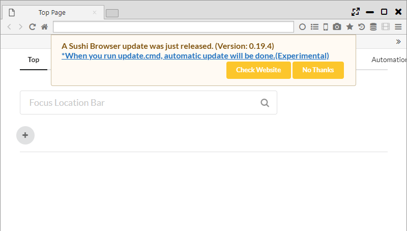

## ポータブル版

Sushi Browserはインストール版とポータブル版の2つを選択できます。  
ポータブル版では、ユーザデータを実行ファイルと同じフォルダに保存することができ、他のPCへ容易にデータを持ち運んだり、
同じPC内に複数のポータブル版ブラウザを起動することができます。

*********

### 1. 設定ファイルの保存先
ポータブル版を起動するとはじめに以下のメッセージが表示されます。  
下記はWindowsで「C:\Users\\[ユーザ名]\Downloads」に解凍した場合のメッセージになります。

>It is launched in Portable version. Whether User Data is stored in
>Portable path(C:\Users\\[ユーザ名]\Downloads\sushi-browser-portable) or
>Default path(C:\Users\\[ユーザ名]\AppData\Roaming)

Portableボタンを押すと、実行ファイルと同じフォルダにユーザデータが保存されます。
Defaultボタンを押すと、インストール版と同じフォルダにユーザデータが保存されます。

また、Portable版では以下のフォルダにデータがそれぞれ保存されます。

- data/resource/extension ・・・ chrome拡張/テーマが保存されます。
- db/resource ・・・ Sushi Browserのユーザデータが保存されます。
    - automation.db - Automation用データ
    - automationOrder.db - Automation用データ
    - download.db - ダウンロード用データ
    - downloader.db - ダウンロード用データ
    - favicon.db - Faviconデータ
    - favorite.db - ブックマークデータ
    - history2.db - 履歴データ
    - image.db - スピードダイヤル用の画像データ
    - note.db - Noteデータ
    - savedState.db - セッションデータ
    - searchEngine.db - 検索エンジン設定
    - state.db - 一般設定
    - syncReplace.db - 同期ページ遷移データ
    - tabState.db - tab履歴データ
    - token.db - sync用データ
    - visit.db - 履歴データ
    - windowState.db - セッション用データ
    

*********

### 2. アップデート(Windows版のみ)

ブラウザの次バージョンを見つけると、バージョンアップのダイアログが表示されます。  
そのダイアログのメッセージの「When you run update.cmd, automatic update will be done.(Experimental)」を
クリックし、update.cmdを実行すると、自動でアップデートが行われます。

