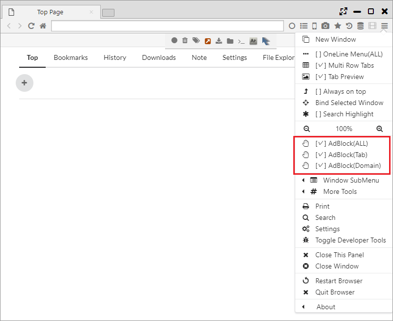

## プライバシーとセキュリティ

Sushi BrowserではBrave Browserの機能を参考にプライバシーやセキュリティに関する機能を搭載しています。  
Adblock、Tor・Private・Sessionタブ、VPN、HTTPS Everywhere、Tracking Protection、Fingerprinting Protectionといった機能があります。  

*********

### 1. Adblock	
ネイティブ実装の高速な広告ブロックです。メインメニューから、全ページ、タブごと、ドメインごとの有効無効を設定できます。

*********

### 2. Torタブ	
匿名通信システム「Tor」を利用したタブになります。高い匿名性での通信を可能とします。

*********

### 3. Private, Sesisonタブ	
他のブラウザと同様に、プライバシーを強化したPrivateタブや、別セッションでの操作が可能なSessionタブ機能があります。  
Sessionタブはセッションごとにタブ上に番号が振られます。

*********

### 4. VPN (Windowsのみ)
VPN Gateサービスを利用した、MS-SSTP VPNによるVPN接続を行います。  
※擬似的なVPNではなく、Windows上に実際のVPNネットワーク接続を作成・接続しますので、ネットワークプロファイリングが作成されます。  

「メインメニュー > その他のツール > Change VPN Mode」で、VPNサーバを選択すると、VPN通信が生成されます。

*********

###5. その他のプライバシー保護機能
- HTTPS Everywhere ・・・ http通信を可能な限りhttps通信に置き換える機能
- Tracking Protection ・・・ Google Analyticsのようなトラッキングサービスからの保護機能
- スクリプトをブロック ・・・ Javascriptを無効にする機能（ほとんどのサイトが動作しなくなります）
- フィンガープリンティングの保護 ・・・ フィンガープリンティングによる情報読み込みを保護する機能
