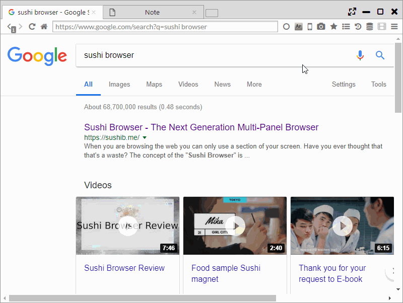

## スクリーンショット

ページ全体のスクリーンショットと選択範囲のスクリーンショットが利用できます。

メインメニューのカメラアイコンにマウスオーバーすると、以下のメニューが表示され、スクリーンショットが取得できます。

 - Full Page | Clipboard ・・・ ページ全体のスクリーンショットをクリップボードに保存
 - Full Page | Jpeg ・・・ ページ全体のスクリーンショットをJPEGで保存
 - Full Page | PNG ・・・ ページ全体のスクリーンショットをPNGで保存
 - Selection | Clipboard ・・・ 選択範囲のスクリーンショットをクリップボードに保存
 - Selection | Jpeg ・・・ 選択範囲のスクリーンショットをJPEGで保存
 - Selection | PNG ・・・ 選択範囲のスクリーンショットをPNGで保存
 
選択範囲のスクリーンショットを選んだ場合、背景が灰色になります。
その後、左クリックを長押しし、マウスを移動・長押しを離すと選択範囲が決定されます。

