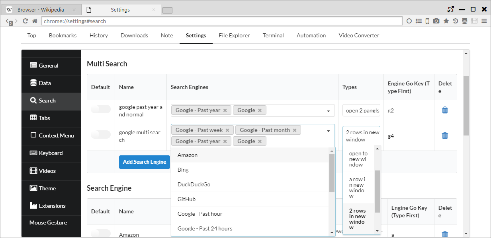

## 検索エンジン

選択範囲を検索することや、複数の検索エンジンでの同時検索など強力な検索機能があります。

*********

### 1. 検索エンジン設定（ショートカット検索）	

「設定　> 検索 > 検索エンジン」から検索エンジンの追加削除、デフォルトの検索エンジンの変更ができます。  
また、検索で利用できるショートカットキーが設定できます。

*********

### 2. 選択範囲、リンクテキストを検索	

選択したテキストやリンクテキストを右クリックすることで、対象のテキストを検索できます。  
また、現在のパネル(c)で開くか、対面パネルで開く(o)かを選択することができ、
設定ページから表示有無も設定できます。

*********

### 3. 複数同時検索	

本ブラウザでは、**他のブラウザにはない「複数同時検索機能」**があります。  

「設定　> 検索 > Multi Search」から検索エンジンの組合せと表示方法を選択できます。  
表示方法は以下のパターンがあります。

- open a panel ・・・ 1つのパネルに全タブを開きます。
- open 2 panels ・・・ 2つのパネルに対し、交互にタブを開きます。
- open to new window ・・・ 新しいウインドウの1つのパネルに全タブを開きます。
- a row in new window ・・・ 新しいウインドウに対し、タブごとに縦にパネルを分割して、1行のパネルに表示します。
- 2 rows in new window ・・・ 新しいウインドウに対し、タブごとに縦にパネルを分割して、2行のパネルに表示します。 
- 3 rows in new window ・・・ 新しいウインドウに対し、タブごとに縦にパネルを分割して、3行のパネルに表示します。

*********

### 4. アドレスバー検索	

アドレスバーでは、検索エンジンによるサジェストと履歴によるサジェストが利用できます。サジェストにはタイトルとURLに加え、PV数と過去の滞在時間が表示されます。  
また、頭にショートカットキーを入力することで、使用する検索エンジンをデフォルトから変更することができます。

「設定 > 一般 > オートコンプリートのデータ」から、サジェスト順、件数を以下により変更することができます。

- Order of AutoComplete ・・・ 「検索エンジンによるサジェスト→履歴」の順か、「履歴→検索エンジンによるサジェスト」の順かを設定
- Number of Suggestions ・・・ 「検索エンジンによるサジェスト」の表示数を設定
- Number of Histories ・・・ 「履歴」によるサジェストの表示数を設定
- Sort history in descending order of PV ・・・ 「履歴」によるサジェストの並び順をページビューの多い順にします（通常は日付が新しい順)

