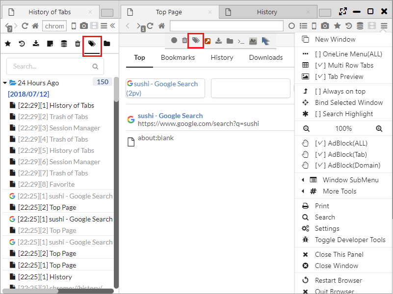

## セッションマネージャ

本ブラウザは、一定間隔ごとにブラウザのウインドウ、タブ状態を保存し、再生するセッション管理機能を有しています。  
また、タブごみ箱やタブ履歴といったタブの復元のための機能もあります。

*********

### 1. セッションマネージャによるウインドウ、タブ状態の復元

メニューバーまたはサイドバーの:fa-database:からセッションマネージャを開くことができます。  
セッションは、ウインドウ群とウインドウ中のタブ群で構成され、ウインドウが2つ以上存在する場合は、それぞれのウインドウに対するタブが保存されています。   
保存されたセッションを右クリックすると以下のメニューが表示され、セッションの復元、操作ができます。

- 新しいウインドウで開く ・・・ セッションの復元を行います。
- 編集 ・・・ セッションのリネームを行います。
- 削除 ・・・ セッションの削除を行います。

*********

### 2. ユーザ保存セッション

メニューバーのセッションマネージャの「Save Current Session」をクリックすることで、現在のセッションを「User Saved Sessions」に保存・復元することができます。

*********

### 3. 保存間隔の設定

「設定 > Data > セッション状態の最小保存間隔 (秒)」からセッションの保存間隔を設定できます。  
保存間隔を過ぎても、セッション状態が変化していない場合は、保存処理がskipされます。

********
	
### 4. タブゴミ箱	

メニューバーまたはサイドバーの:fa-trash:からタブゴミ箱を開くことができます。  
タブのゴミ箱は過去に閉じた時点のタブが蓄積されており、選択したタブを復元することができます。

********

### 5. タブ履歴

メニューバーまたはサイドバーの:fa-tags:からタブ履歴を開くことができます。  
タブ履歴は過去の全てのタブのページ遷移履歴を保持しています。最後にアクティブだったページ以外は灰色文字になっています。

