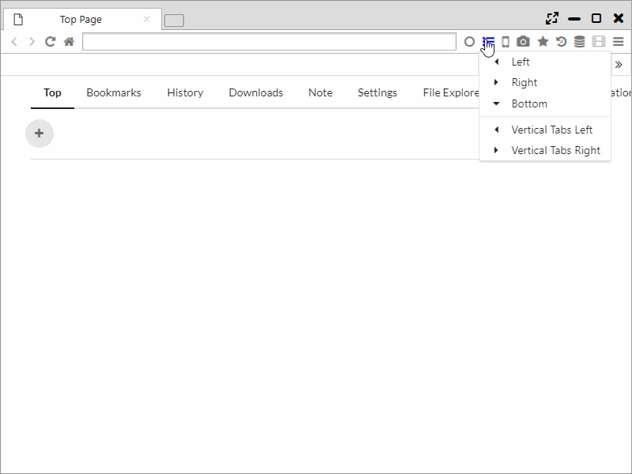
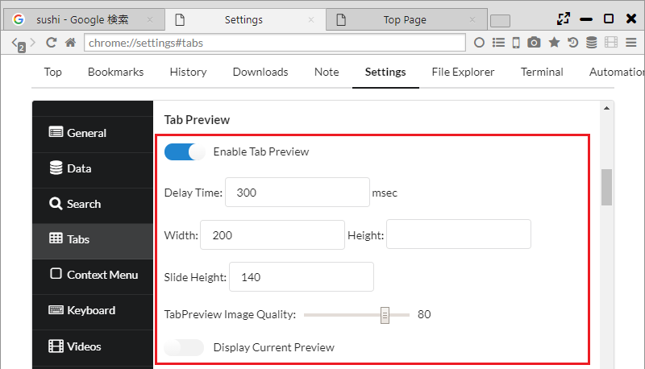

##タブ機能

Sushi Browserはタブに関しても、画面の有効利用や便利機能の取り込みを積極的に行っています。  
例えば、FirefoxのアドオンのTab Mix Plusに相当する機能を多数取り入れています。

*********

### 1. 多段タブ
Sushi Browserでは多段タブを利用でき、メインメニューから通常タブと多段タブを切り替えることができます。  
また、「設定 > タブ」から多段タブの段数や最小や最大のタブ幅が設定可能です。

*********

### 2. 縦タブ、ツリータブ
Sushi Browserでは縦タブを利用でき、メニューバーのサイドバーアイコンから縦タブを表示することができます。  
縦タブ表示時は、通常のタブを非表示にすることも可能です。

また、ツリータブ（タブを開いた順に階層となる）の利用も可能で、パネル間の関係性は番号で表現されます。

*********

### 3. マウスホイールによるタブ選択
タブバー上でマウスホイールを動かすことで、スクロールによりタブを選択できます。  
また、循環式の選択(最後まで移動したら、次は最初のタブへ移動する)も設定可能です。

*********

### 4. タブプレビュー
ポップアップ方式とスライド方式のタブプレビューが利用できます。(EdgeやVivaldiと同様)  
メインメニューから ON/OFFを切り替えることができます。  
また、タブプレビューのサイズや画像のクオリティ、表示タイミングの設定も可能です。 
 
ポップアップ方式のタブプレビューに関しては、以下も設定可能です。  

 ・ 幅または高さに空にすると、縦横比から自動でサイズを設定します。両方からにすると原寸大サイズで表示されます。  
 ・ 「Display Current Preview」をONにすると、常に最新のプレビューが表示されます。(通常はロード完了時のプレビューが表示)

******

### 5. タブ設定

#### 一般設定

- [新しいウィンドウに開く] リンクの開く場所: 
    - 新しいウインドウ ・・・ 新しいウインドウにリンクを開きます。
    - 新しいタブ ・・・ 現在のウインドウの新しいタブにリンクを開きます。

- 現在のタブを閉じたときのフォーカスの移動場所:
    - 左側のタブ
    - 右側のタブ
    - 最後に選択したタブ
    - リンク元／右側のタブ
    - リンク元／左側のタブ
    - 最後に開いたタブ
    - 先頭のタブ
    - 最後のタブ
  

- 最後のタブを閉じたとき、ウィンドウ自体は閉じない

- タブを再読み込みする間隔 (秒) ・・・ オートリロード機能の間隔を設定できます。

- TabBar Top Margin ・・・ タブバーの上部のマージンサイズを設定できます。

- Remove Top Margin When Maximizing ・・・ 最大化時にタブバー上部のマージンを消去するかの設定ができます。

***

#### 新しいタブ

- 新しいタブを現在のタブの直後に開く

- Open New Tabs At
    - Default Position
    - Left End ・・・ 左端に開く
    - Right End ・・・ 右端に開く

- 強制的に新しいタブで開くリンクの種類
    - なし
    - 他サイトへのリンク
    - すべてのリンク

- Open New Tab in Background ・・・ 新しいタブをバックグラウンドで開く

- Opposite Mode ・・・ バックグラウンドタブを開くと、対面パネルのタブとして開かれます。

***

#### Tab Preview

- Enable Tab Preview ・・・ タブプレビューを有効にする。

- Delay Time ・・・ タブプレビュー表示までの遅延時間

- Width Height ・・・ タブプレビューのサイズ
 
- Slide Height ・・・ スライド方式のタブプレビューの高さ

- TabPreview Image Quality ・・・ 画像の品質

- Display Current Preview ・・・ 最新のプレビューを常に表示する

***

#### タブ表示

- 多段表示にする

- バーの最大表示段数 ・・・ 多段タブの最大段数の設定
- タブ幅

***

#### タブバー上でのスクロール動作

- タブ選択をスクロール

- スクロール方向を反転

- Circulate Tab Selection ・・・ タブの選択を循環する

***

#### タブのフォーカス

- マウスオーバーでタブを選択

- 現在のタブをクリックしたとき、直前にフォーカスしていたタブにフォーカスを移す

***

#### マウスクリック

- ダブルクリック

- 中クリック

- Alt + クリック

***
#### [新しいタブ] ボタン

- Right Click

- 中クリック

- Alt + クリック

*******

### 6.タブに対して可能な操作 (タブのコンテキストメニュー)

- 新しいタブ
- 新しいプライベートタブ
- New Tor Tab ・・・ 新しいTorタブを開く
- 新しいセッションタブ

- Split Left ・・・ パネルを左側に分割
- Split Right ・・・ パネルを右側に分割
- Split Top  ・・・ パネルを上側に分割
- Split Bottom ・・・ パネルを下側に分割
- Split left tabs to left ・・・ 現在のタブより左のタブを左側のパネルに分割
- Split right tabs to right ・・・ 現在のタブより右のタブを右側のパネルに分割

- Floating Panel ・・・ タブをフローティングパネルに分離
- Swap Position ・・・ パネルの位置を入れ替え
- Switch Direction ・・・ パネルの方向を入れ替え
- Align Horizontal ・・・ 水平方向に整列
- Align Vertical ・・・ 垂直方向に整列

- タブの URL をコピー
- クリップボードの URL を開く
- Paste and Open ・・・　新しいタブでクリップボードのURLを開く(改行区切りで複数のURLを開くことも可能)
- Copy Tab Info ・・・ タブの情報(番号、URL、タイトル)をコピー
- Copy All Tab Titles ・・・ 全タブのタイトルをコピー
- Copy All Tab URLs ・・・ 全タブのURLコピー
- Copy All Tab Infos  ・・・ 全タブの情報(番号、URL、タイトル)をコピー

- 再読み込み
- キャッシュを破棄して再読み込み
- すべてのタブを再読み込み
- 他のタブを再読み込み
- 左側のタブをすべて再読み込み
- 右側のタブをすべて再読み込み
- タブを再読み込みする間隔 ・・・一定間隔でオートリロード

- タブを複製
- タブを固定 ・・・ タブを左端に寄せ、faviconのみ表示
- タブをミュート
- タブを凍結 ・・・ タブを保護、タブをロックの両方を実施
- タブを保護 ・・・ タブのクローズを不可とする
- タブをロック ・・・ 対象タブのリンクを全て新しいタブに開く

- 閉じる
- 他のタブを閉じる
- 左側のタブを閉じる
- 右側のタブを閉じる
- すべてのタブを閉じる
- 最後に閉じたタブを開く
- [最近閉じたタブ] をすべて開く

- このページをブックマーク
- すべてのタブをブックマークに追加する

- 再読み込み
- キャッシュを破棄して再読み込み

- 複数のタブを閉じる
- Close This Tree ・・・ ツリータブの階層ごとタブをクローズ

