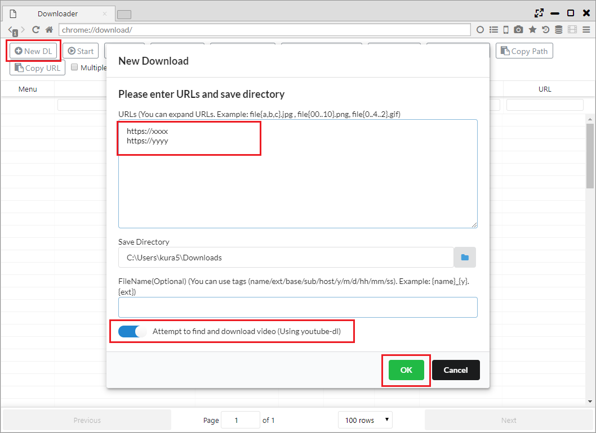
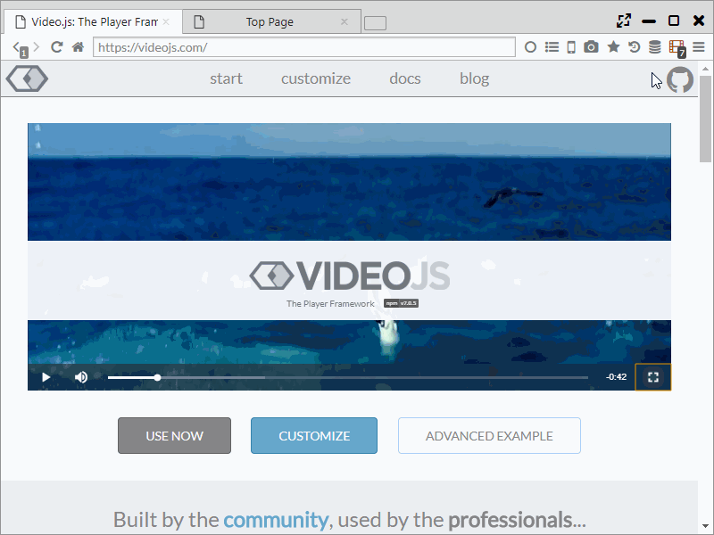
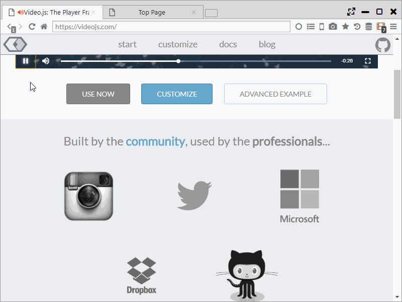

##動画支援機能

Sushi Browserは、動画ダウンロードやマウス操作などの支援機能を備えており、
動画再生用ブラウザとして活用できます。  
※動画ダウンロードに関しては、Webサービスの規約違反とならないように自己責任での利用をお願いいたします。

*********

### 1. 動画ダウンロード  

**・動画検出**  
Webページに動画が存在することを検出すると、ツールバー上の動画アイコンが赤くなります。  
動画アイコンをクリックすると、一覧が表示され以下の操作が行えます。   
 (A) 一覧上の項目をクリック： 動画のダウンロードが開始します。  
 (B) :fa-play:： 内臓プレイヤー([videojs](https://videojs.com/)を利用)で動画が再生されます。  
 (C) :fa-play-circle:： 動画のダウンロードと同時に、5%ダウンロードしたところで規定の動画プレイヤーで再生を開始します。(オススメ)  
 (D) :fa-play-circle-o:： 設定ページで設定した外部動画プレイヤーでの再生が開始されます。  
 (E) :fa-download:： 動画を名前を付けて保存します。  
 (F) :fa-industry:： 動画を保存した後に、Sushi Browserに内蔵している動画コンバータ(handbreakを利用)にデータを渡します。  
 (E) :fa-music:： 動画を保存した後に、音声データを抽出して保存します。  
 (G) クリップボードアイコン： 動画のURLをクリップボードに保存します。  

また、動画URLを右クリックし、「Save and Play Video」を選択すると(C)と同じ動作を行います。  
 
 

**・ストリーミング動画(.m3u8)**  
[youtube-dl](https://rg3.github.io/youtube-dl/)の機能を利用して、HLSストリーミング動画(.m3u8)のダウンロードが行えます。 
動画アイコンをクリックすると、一覧が表示され以下の操作が行えます。   
 (A) 一覧上の項目をクリック： youtube-dlとTerminal機能を利用した動画のダウンロードが開始します。  
 (B) :fa-play-circle-o:： 設定ページで設定した外部動画プレイヤーでの再生が開始されます。  
 (C) :fa-download:： 動画を名前を付けて保存します。  
 (D) クリップボードアイコン： 動画のURLをクリップボードに保存します。  

**・一括ダウンロード (youtube-dlによる動画抽出)**  
Sushi Browserではダウンローダ機能で、一括ダウンロードが行なえます。  
その中で、「Attempt to find and download video (Using youtube-dl)」を有効にすると、youtube-dlを利用して、対象のURLから動画を検出しダウンロードします。

*********

### 2. ポップアップウインドウ、パネル
再生中の動画を右クリックしたコンテキストメニュー、または動画アイコンをクリックした後に表示されるメニューから以下を選択すると
ポップアップウインドウまたはパネルとして、動画が切り出されます。

- Play Video in Popup Window
- Play Video in Floating Panel

*********

### 3. マウス、キーボード操作
再生中の動画に対して、動画プレイヤーのようにマウス・キーボードによる様々な操作が設定できます。  
デフォルトでは、**マウスホイールで動画のシーク**、ダブルクリックで全画面化ができます。  
また、Ctrlを押しながらマウスホイールを操作すると音量の調整も可能です。

「設定 > 動画」で各操作を設定できます。

*********

### 4. ミュート・音量変更
動画再生中に、タブ上の音量アイコンをクリックすることでミュート状態への切り替えができます。  
音量アイコンをマウスオーバーすると音量バーが表示され、対象タブの音量を**最大800%**まで変更することができます。

*********

### 5. 外部プレイヤーにURLを送る
「1. 動画ダウンロード」で記載したように、動画URLを設定した外部プレイヤーに送ることができます。  
「設定 > 一般」の「Send URL to external media player」で設定ができます。

*********

### 6. 音声抽出、動画変換
「1. 動画ダウンロード」で記載したように、動画のダウンロードと同時に音声抽出や動画の変換ができます。  
また、メインメニューからローカルファイルに対しても、音声抽出は行うことができます。

